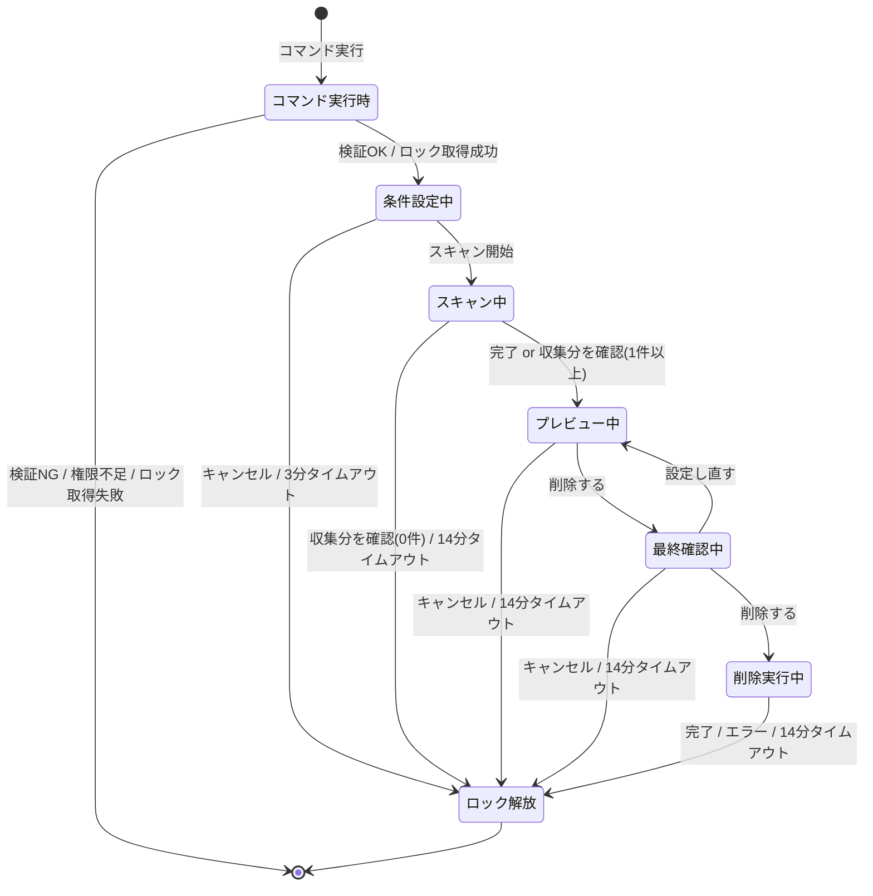
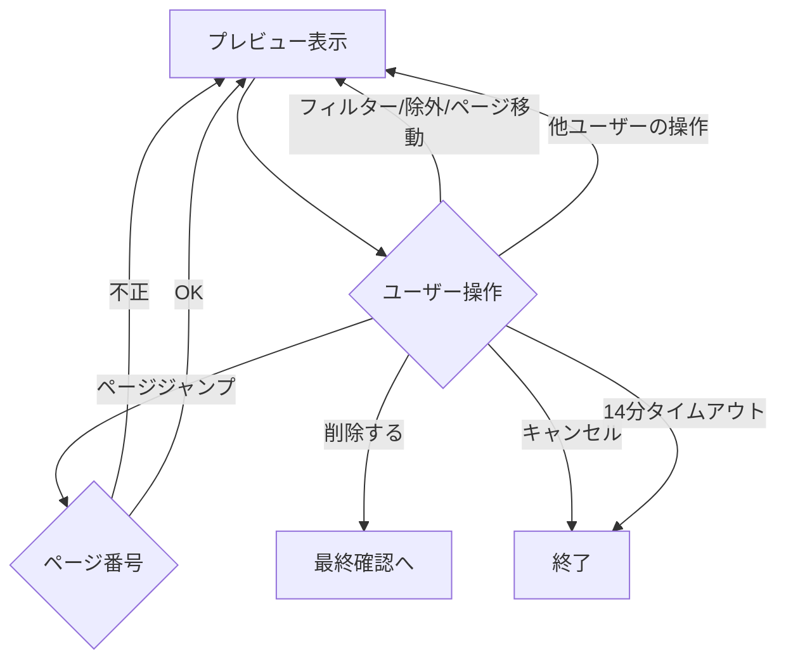
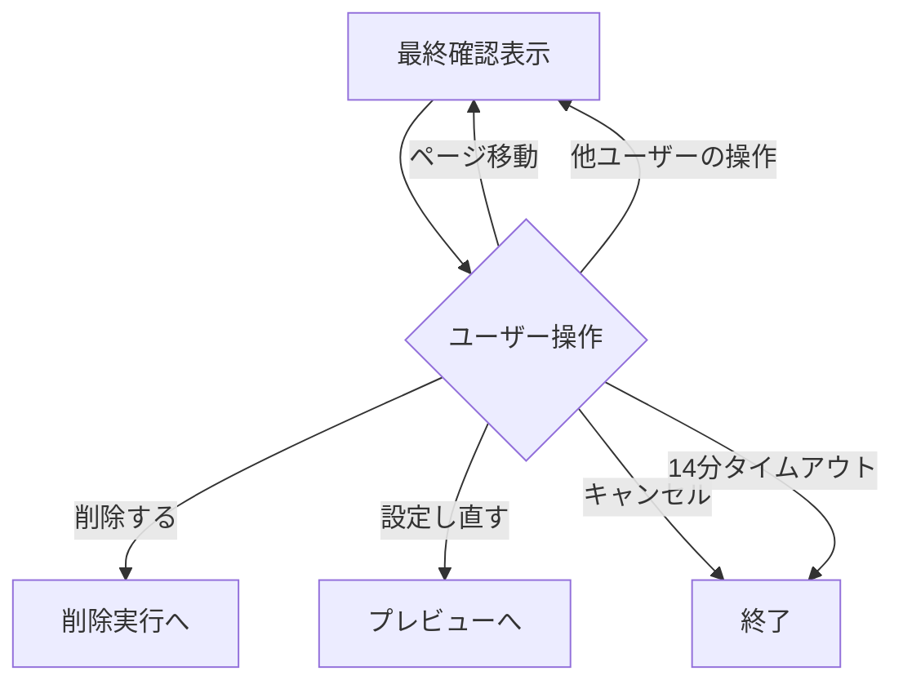
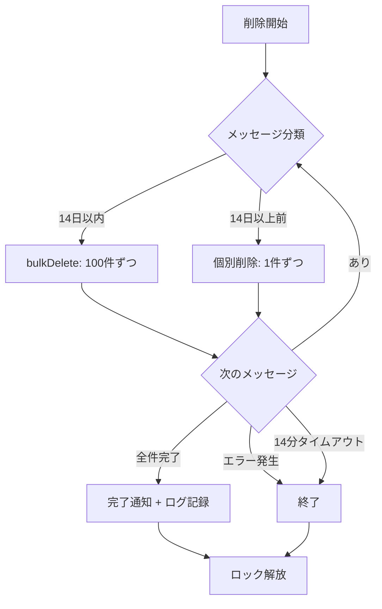

# メッセージ削除機能 - 仕様書

> モデレーター向けメッセージ一括削除

最終更新: 2026年3月18日

---

## 概要

モデレーター権限を持つユーザーが、サーバー内の全チャンネルまたは特定チャンネルにわたって、特定ユーザーのメッセージ・キーワード一致メッセージ・指定件数のメッセージを一括削除できる機能。スパムや不適切なメッセージの迅速な対応を可能にする。

### 機能一覧

| 機能                         | 概要                                                               |
| ---------------------------- | ------------------------------------------------------------------ |
| フィルター条件による絞り込み | ユーザー・キーワード・期間・チャンネルを組み合わせて削除対象を指定 |
| プレビューと除外             | 削除前に対象メッセージを確認し、個別に除外できる                   |
| 削除前の最終確認             | 不可逆操作のため、削除実行前に確認ダイアログを表示                 |
| 処理中ロック                 | サーバー単位で重複実行を防止。実行中は他ユーザーも含め新規実行不可 |

### 権限モデル

| 対象   | 権限                   | 用途                   |
| ------ | ---------------------- | ---------------------- |
| 実行者 | `MANAGE_MESSAGES`      | コマンド実行           |
| Bot    | `MANAGE_MESSAGES`      | メッセージの削除       |
| Bot    | `READ_MESSAGE_HISTORY` | メッセージ履歴の取得   |
| Bot    | `VIEW_CHANNEL`         | チャンネルへのアクセス |

権限不足の場合はエラーメッセージを表示し、ログに記録する。

---

## コマンド定義

**コマンド**: `/message-delete [count] [keyword] [days] [after] [before]`

**実行権限**: `MANAGE_MESSAGES`

**コマンドオプション:**

| オプション名 | 型      | 必須 | 説明                                                                      |
| ------------ | ------- | ---- | ------------------------------------------------------------------------- |
| `count`      | Integer | ❌   | 削除メッセージ数の上限（全チャンネル合計）。1〜1000。未指定時は1000件上限 |
| `keyword`    | String  | ❌   | 本文に対する部分一致検索（case-insensitive）。`user` と AND で併用可      |
| `days`       | Integer | ❌   | 過去N日以内（1〜366）。`after` / `before` と排他                          |
| `after`      | String  | ❌   | この日時以降のメッセージのみ対象。`days` と排他                           |
| `before`     | String  | ❌   | この日時以前のメッセージのみ対象。`days` と排他                           |

条件設定フェーズで追加選択:

| オプション名 | 型                | 必須 | 説明                                                                                                                                                      |
| ------------ | ----------------- | ---- | --------------------------------------------------------------------------------------------------------------------------------------------------------- |
| `user`       | UserSelectMenu    | ❌   | 削除対象ユーザー（最大25人、複数選択可）。Webhook は別途モーダルで ID 入力                                                                                |
| `channel`    | ChannelSelectMenu | ❌   | 対象チャンネル（最大25、複数選択可）。未指定でサーバー全体。対象種別: TextChannel / NewsChannel / Thread / VoiceChannel（テキストチャット機能を持つため） |

**`after` / `before` の日時解釈:**

- `YYYY-MM-DD` → ロケール推定タイムゾーンで解釈（`after` は `00:00:00`、`before` は `23:59:59`）
- `YYYY-MM-DDTHH:MM:SS` → ロケール推定タイムゾーンで解釈
- `YYYY-MM-DDTHH:MM:SS±HH:MM` → 指定オフセットをそのまま適用
- タイムゾーン指定なしの場合は `interaction.locale` から推定（日本語 → JST、UTC 系 → UTC など）
- 未来の日付は指定不可。ただし `YYYY-MM-DD` 形式の当日指定は許可
  - **`after`**: `YYYY-MM-DD` は `00:00:00` と解釈し、その時刻が現在以前なら有効。`YYYY-MM-DDTHH:MM:SS[±HH:MM]` は指定時刻そのものが現在以前なら有効
  - **`before`**: `YYYY-MM-DD` は `23:59:59` と解釈するが、未来判定は `00:00:00` 基準で行う（当日指定を許可するため、`23:59:59` が未来でも `00:00:00` が現在以前なら有効）。`YYYY-MM-DDTHH:MM:SS[±HH:MM]` は指定時刻そのものが現在以前なら有効

---

## 動作フロー



> 全終了パス（正常完了・キャンセル・タイムアウト・エラー・例外）で finally によりロック解放

**処理中ロック:** サーバー単位。同一サーバー内でどのユーザーがロック中でも新たな実行を拒否。メモリ管理のため Bot 再起動で自動クリア

### コマンド実行時

1. オプション検証 → NG ならエラー表示して終了
   - `days` と `after`/`before` 同時指定
   - `after` / `before` の日付形式不正
   - `after` >= `before`
   - `after` / `before` に未来の日付
   - `days` に不正な値
2. 権限チェック（実行者・Bot） → 不足ならエラー表示して終了
3. ロック取得 → 失敗ならエラー表示して終了
4. 条件設定フェーズへ

### 条件設定

- ユーザー/チャンネル選択、Webhook ID 入力（不正形式はエラー表示して再入力）を繰り返し可能
- 「スキャン開始」ボタン押下 → フィルタ条件検証を実行し、OK ならスキャンへ
- キャンセル / 3分タイムアウト → ロック解放して終了

フィルタ条件検証（スキャン開始ボタン押下時）:

- `count`・`user`・`keyword`・`days`・`after`・`before` のいずれも未指定の場合はスキャン開始を拒否
- `channel` のみ指定も拒否（フィルタ条件なしでチャンネル全削除になるため）

**UIコンポーネント:**

| 行  | コンポーネント    | customId                                                                                    | 動作                                                                  |
| --- | ----------------- | ------------------------------------------------------------------------------------------- | --------------------------------------------------------------------- |
| 1   | UserSelectMenu    | `message-delete:select-user`                                                                | 最大25人、複数選択可。`minValues: 0`、`maxValues: 25`                 |
| 2   | ChannelSelectMenu | `message-delete:select-channel`                                                             | 最大25チャンネル、テキストベースのみ。`minValues: 0`、`maxValues: 25` |
| 3   | ボタン×3          | `message-delete:start-scan` / `message-delete:webhook-input` / `message-delete:cond-cancel` | スキャン開始 / Webhook ID 入力モーダル / キャンセル                   |

**Webhook ID 入力モーダル:**

- 「📩 Webhook ID を入力」ボタンから表示
- 受け付け形式: 生のID（17〜20桁の数字）。不正な形式はエラー
- 入力した Webhook ID は対象ユーザーリストに追加

### スキャン

チャンネルリストを構築し、アクセス可能なチャンネルに対して k-way マージでスキャンを実行する。

**状態遷移:**

| 条件                                       | 収集件数 | 次の状態     | 表示メッセージ                                                                                           |
| ------------------------------------------ | -------- | ------------ | -------------------------------------------------------------------------------------------------------- |
| channel 指定時、一部アクセス不可           | —        | スキャン続行 | スキップしたチャンネルを通知                                                                             |
| channel 指定時、全チャンネルアクセス不可   | —        | 終了         | `❌ 指定したチャンネルにアクセスできません。BotにReadMessageHistoryおよびManageMessages権限が必要です。` |
| channel 未指定、アクセス不可チャンネルあり | —        | スキャン続行 | （通知なくスキップ）                                                                                     |
| channel 未指定、全チャンネルアクセス不可   | 0件      | 終了         | `ℹ️ 削除可能なメッセージが見つかりませんでした。`                                                        |
| スキャン正常完了                           | 1件以上  | プレビューへ | （なし、直接遷移）                                                                                       |
| スキャン正常完了                           | 0件      | 終了         | `ℹ️ 削除可能なメッセージが見つかりませんでした。`                                                        |
| 「収集分を確認」ボタン押下                 | 1件以上  | プレビューへ | （なし、直接遷移）                                                                                       |
| 「収集分を確認」ボタン押下                 | 0件      | 終了         | `❌ 削除をキャンセルしました。`                                                                          |
| 14分タイムアウト                           | 1件以上  | プレビューへ | `⌛ スキャンがタイムアウトしました。収集済みのメッセージでプレビューを表示します。`                      |
| 14分タイムアウト                           | 0件      | 終了         | タイムアウトメッセージを表示                                                                             |
| チャンネル・メッセージ削除等による中断     | 1件以上  | プレビューへ | （なし、直接遷移）                                                                                       |
| チャンネル・メッセージ削除等による中断     | 0件      | 終了         | `❌ 削除をキャンセルしました。`                                                                          |
| 例外発生                                   | —        | 終了         | `❌ メッセージの収集中にエラーが発生しました`                                                            |

**k-wayマージアルゴリズム:**

1. `beforeTs` を Discord Snowflake ID に変換（初回フェッチ位置の最適化）
2. 全チャンネルを**並列**で初期フェッチ（`limit: 100, before: beforeSnowflake`）し、チャンネルごとのカーソルを初期化
3. k-wayマージループ（`収集件数 < count` の間）:
   a. キャンセルシグナル確認（「収集分を確認」ボタン押下時に中断）
   b. バッファが空かつ未消耗のチャンネルを追加フェッチ（直列・レートリミット考慮で 200ms 待機）
   c. 全チャンネルのバッファ先頭のうち最新タイムスタンプを持つメッセージを選択
   d. 選択不可ならループ終了（全チャンネル消耗）
   e. user・keyword フィルタ適用、不一致はスキップ（スキャン総件数にはカウント）
   f. 収集リストに追加
4. チャンネル消耗判定: フェッチ結果が0件/100件未満、または最古メッセージが `afterTs` より古い場合は消耗済み。`afterTs` より古いメッセージはバッファから除外
5. `count` 件収集した時点でループ早期終了（全チャンネルスキャン完了前でも停止）

**UIコンポーネント:**

**表示テキスト:**

```
スキャン中... N件
対象メッセージを検索中... M / L件
```

- N: スキャン済み総件数（フィルタ適用前の走査件数）
- M: 条件一致件数
- L: 削除上限件数（`count` 値、未指定時 1000）
- チャンネルごとのフェッチ完了ごとに `editReply` で更新

| 行  | コンポーネント           | customId                     | 動作                                               |
| --- | ------------------------ | ---------------------------- | -------------------------------------------------- |
| 1   | ボタン×1（収集分を確認） | `message-delete:scan-cancel` | スキャン中断。1件以上ならプレビューへ、0件なら終了 |

### 確認（プレビュー ↔ 最終確認）

確認フェーズはプレビュー（Stage 1）と最終確認（Stage 2）の2ステージで構成される。最終確認の「戻る」でプレビューに戻るループ構造。タイムアウトは確認フェーズ全体で共有する。

#### プレビュー（Stage 1）



**Embed 1: コマンド条件（独自 Embed / 静的）**

| 項目       | 内容                                                                    |
| ---------- | ----------------------------------------------------------------------- |
| タイトル   | 📋 コマンド条件                                                         |
| カラー     | muted（`#95a5a6`）                                                      |
| フィールド | コマンドオプションと1:1。全オプションを常に表示、未設定は括弧書きで明示 |

| フィールド名 | 設定ありの例        | 未設定の例                                     |
| ------------ | ------------------- | ---------------------------------------------- |
| `count`      | `500 件`            | `(上限なし: 1000 件)`                          |
| `user`       | `<@ID1> <@ID2> ...` | `(全員対象)`                                   |
| `keyword`    | `"スパム"`          | `(なし)`                                       |
| `days`       | `過去 7 日間`       | —（after/before と排他、設定された方のみ表示） |
| `after`      | `2026-01-01 以降`   | `(なし)`                                       |
| `before`     | `2026-02-01 以前`   | `(なし)`                                       |
| `channel`    | `<#ID1> <#ID2> ...` | `(サーバー全体)`                               |

**Embed 2: 削除対象メッセージ（動的）**

`createInfoEmbed` 使用

| 項目       | 内容                                                            |
| ---------- | --------------------------------------------------------------- |
| タイトル   | 削除対象メッセージ                                              |
| フィールド | メッセージ1件ずつ（5件/ページ）。除外済みは ~~取り消し線~~ 表示 |

- 投稿日時は `<t:unix秒:f>` 形式（Discord が閲覧者のローカル時刻に自動変換）
- 本文は `MSG_DEL_CONTENT_MAX_LENGTH` で省略、末尾に `…`
- フィルター適用状態はボタンの色で確認（未適用: Secondary/グレー、適用中: Primary/青）

**Row 1 - ページネーション:**

単ページ時はこの行ごと非表示。

| コンポーネント | emoji | ラベル | スタイル | 動作 |
| --- | --- | --- | --- | --- |
| `message-delete:first` | ⏮ | ― | Secondary | 最初のページ（1ページ目は `disabled`） |
| `message-delete:prev` | ◀ | ― | Secondary | 前のページ（1ページ目は `disabled`） |
| `message-delete:jump` | ― | {{page}}/{{total}}ページ | Secondary | 押下でモーダル表示、番号入力でページジャンプ |
| `message-delete:next` | ▶ | ― | Secondary | 次のページ（最終ページは `disabled`） |
| `message-delete:last` | ⏭ | ― | Secondary | 最後のページ（最終ページは `disabled`） |

**Row 2 - 投稿者フィルター:**

| コンポーネント | 種別 | 設定 |
| --- | --- | --- |
| `message-delete:filter-author` | StringSelect | 投稿者フィルター。選択肢はスキャン全体から収集（フィルター状態に依存しない） |

**Row 3 - フィルターボタン:**

適用中はラベルに入力値をそのまま表示（例: `📅 after: 2026-01-01`）。未適用: Secondary/グレー、適用中: Primary/青。

| コンポーネント | emoji | ラベル | スタイル | 動作 |
| --- | --- | --- | --- | --- |
| `message-delete:filter-days` | ― | 日数 / 入力値 | Secondary or Primary | モーダル入力で日数フィルター設定 |
| `message-delete:filter-after` | 📅 | after / 入力値 | Secondary or Primary | モーダル入力で開始日時フィルター設定 |
| `message-delete:filter-before` | 📅 | before / 入力値 | Secondary or Primary | モーダル入力で終了日時フィルター設定 |
| `message-delete:filter-keyword` | 🔍 | キーワード / 入力値 | Secondary or Primary | モーダル入力でキーワードフィルター設定 |
| `message-delete:filter-reset` | ✖️ | フィルターリセット | Secondary | 全フィルターをクリア |

**Row 4 - 除外セレクト:**

| コンポーネント | 種別 | 設定 |
| --- | --- | --- |
| `message-delete:confirm-exclude` | StringSelect | 現在ページの件を表示。トグルで除外追加/解除。`minValues: 0`、`maxValues: ページ件数` |

**Row 5 - アクションボタン:**

| コンポーネント | emoji | ラベル | スタイル | 動作 |
| --- | --- | --- | --- | --- |
| `message-delete:confirm-yes` | 🗑️ | 削除する（N件） | Danger | 最終確認へ |
| `message-delete:confirm-no` | ❌ | キャンセル | Secondary | キャンセル → 終了 |

**除外の仕様:**

- 除外セットはページをまたいで保持
- 除外済みは Embed フィールド名を ~~取り消し線~~ 表示
- セレクトメニューは除外済みを選択済み状態で表示
- 「削除する（N件）」の N = スキャン結果全体 − 除外セット件数（フィルター状態に依存しない）
- 全件除外時は「削除する」ボタンを無効化
- **フィルターは表示の絞り込みのみ**で削除対象件数には影響しない。フィルター中に「削除する」を押しても表示されていないメッセージも含めて全件（除外分を除く）が削除される

#### 最終確認（Stage 2）



**Embed:**

`createWarningEmbed` 使用

| 項目       | 内容                                                      |
| ---------- | --------------------------------------------------------- |
| タイトル   | 本当に削除しますか？                                      |
| 説明       | `⚠️ **この操作は取り消せません**` + 合計件数              |
| フィールド | メッセージ1件ずつ（5件/ページ）。除外されなかったもののみ |

**Row 1 - ページネーション:**

単ページ時はこの行ごと非表示。

| コンポーネント | emoji | ラベル | スタイル | 動作 |
| --- | --- | --- | --- | --- |
| `message-delete:first` | ⏮ | ― | Secondary | 最初のページ（1ページ目は `disabled`） |
| `message-delete:prev` | ◀ | ― | Secondary | 前のページ（1ページ目は `disabled`） |
| `message-delete:jump` | ― | {{page}}/{{total}}ページ | Secondary | 押下でモーダル表示、番号入力でページジャンプ |
| `message-delete:next` | ▶ | ― | Secondary | 次のページ（最終ページは `disabled`） |
| `message-delete:last` | ⏭ | ― | Secondary | 最後のページ（最終ページは `disabled`） |

**Row 2 - アクションボタン:**

| コンポーネント | emoji | ラベル | スタイル | 動作 |
| --- | --- | --- | --- | --- |
| `message-delete:final-yes` | 🗑️ | 削除する | Danger | 削除実行 |
| `message-delete:final-back` | ◀ | 設定し直す | Secondary | プレビューに戻る（除外セット・フィルター状態は保持） |
| `message-delete:final-no` | ❌ | キャンセル | Secondary | 終了 |

- フィルター・除外操作なし（読み取り専用の確認画面）
- プレビューで適用していたフィルターは最終確認には引き継がれない

### 削除実行



削除済みメッセージに遭遇した場合はエラーを無視して継続する（ログに警告）。

**削除進捗の表示:**

```
削除中... N / T件
<#チャンネルID>: deleted / total件
<#チャンネルID>: deleted / total件
```

- チャンネルメンション形式（`<#チャンネルID>`）でクリッカブル表示

**完了メッセージ:**

1件以上削除した場合:

```
✅ 削除完了
合計削除件数: 45件

チャンネル別内訳:
  <#チャンネルID>: 20件
  <#チャンネルID>: 15件
  <#チャンネルID>: 10件
```

0件の場合:

```
ℹ️ 削除可能なメッセージが見つかりませんでした。
```

---

## 制約・制限事項

- **削除上限**: 全チャンネル合計で最大1000件（`count` 未指定時）
- **処理中ロック**: サーバー単位。スキャン〜削除実行の間、同一サーバーの全ユーザーが新規実行不可。全終了パスで `finally` により確実に解放。Bot 再起動時は自動クリア
- **bulkDelete の14日制限**: Discord API の制約。14日以内は bulkDelete（100件ずつ、数秒）、14日以上前は個別削除（1件約0.5秒）
- **レート制限**: メッセージフェッチ・削除は100件ずつ分割
- **パフォーマンス目安**: bulkDelete 100件 = 数秒、個別削除 100件 ≈ 50秒、500件 ≈ 250秒（約4分）
- **タイムアウト設計**: ボタン操作の `deferUpdate()` で fresh Interaction token（15分）を取得し、14分（1分バッファ）使える。ステージ遷移のたびにリセットされるため、前のステージ/フェーズの残り時間を引き継がない
  - 条件設定フェーズ: 3分
  - スキャンフェーズ: 14分
  - 確認フェーズ: 各ステージで独立して14分（Stage 1 → Stage 2 の遷移、「戻る」による Stage 1 への復帰でそれぞれ fresh token）。「戻る」でループするたびに14分が再付与されるため、確認フェーズ全体の上限は固定ではない。ただしアイドルタイムアウト（3分無操作）により放置時は打ち切られる
  - 削除実行フェーズ: 14分
  - モーダル操作は各ボタン interaction の fresh token を使用
- **アイドルタイムアウト（3分）**: 確認フェーズのコレクターに設定。エフェメラルメッセージの非表示は `MESSAGE_DELETE` イベントが発生しないため、ロック長時間保持を回避。操作のたびにリセット

---

## ローカライズ (新規約に移行予定)

**翻訳ファイル:** `src/shared/locale/locales/{ja,en}/features/messageDelete.ts`

### コマンド定義

| キー | ja | en |
| --- | --- | --- |
| `message-delete.description` | メッセージを一括削除します（デフォルト: サーバー全チャンネル） | Bulk delete messages (default: all channels in server) |
| `message-delete.count.description` | 削除するメッセージ数（1〜1000、未指定時は最新1000件を上限に削除） | Number of messages to delete (1–1000, defaults to 1000 if omitted) |
| `message-delete.user.description` | 削除対象のユーザーID またはメンション（Webhookの場合はIDを直接入力） | Target user ID or mention (for webhooks, paste the user ID directly) |
| `message-delete.keyword.description` | 本文に指定キーワードを含むメッセージのみ削除（部分一致） | Delete messages containing this keyword (case-insensitive partial match) |
| `message-delete.days.description` | 過去N日以内のメッセージのみ削除（1〜366、after/beforeとの同時指定不可） | Delete only messages from the past N days (1–366, cannot combine with after/before) |
| `message-delete.after.description` | この日時以降のメッセージのみ削除 (YYYY-MM-DD または YYYY-MM-DDTHH:MM:SS) | Delete only messages after this date (YYYY-MM-DD or YYYY-MM-DDTHH:MM:SS) |
| `message-delete.before.description` | この日時以前のメッセージのみ削除 (YYYY-MM-DD または YYYY-MM-DDTHH:MM:SS) | Delete only messages before this date (YYYY-MM-DD or YYYY-MM-DDTHH:MM:SS) |
| `message-delete.channel.description` | 削除対象を絞り込むチャンネル（未指定でサーバー全体） | Restrict deletion to a specific channel (default: entire server) |

### ユーザーレスポンス

| キー | ja | en |
| --- | --- | --- |
| `user-response.user_invalid_format` | \`user\` の形式が不正です。ユーザーIDまたはメンション（例: \`<@123456789>\`）を入力してください。 | Invalid \`user\` format. Enter a user ID or mention (e.g. \`<@123456789>\`). |
| `user-response.no_filter` | フィルタ条件が指定されていないため実行できません。\`count\`・\`user\`・\`keyword\`・\`days\`・\`after\`・\`before\` のいずれか1つを指定してください。 | No filter condition specified. Please provide at least one of: \`count\`, \`user\`, \`keyword\`, \`days\`, \`after\`, \`before\`. |
| `user-response.days_and_date_conflict` | \`days\` と \`after\`/\`before\` は同時に指定できません。どちらか一方を使用してください。 | \`days\` cannot be combined with \`after\`/\`before\`. Use one or the other. |
| `user-response.after_invalid_format` | \`after\` の日付形式が不正です。\`YYYY-MM-DD\` または \`YYYY-MM-DDTHH:MM:SS\` 形式で指定してください。 | Invalid \`after\` date format. Use \`YYYY-MM-DD\` or \`YYYY-MM-DDTHH:MM:SS\`. |
| `user-response.before_invalid_format` | \`before\` の日付形式が不正です。\`YYYY-MM-DD\` または \`YYYY-MM-DDTHH:MM:SS\` 形式で指定してください。 | Invalid \`before\` date format. Use \`YYYY-MM-DD\` or \`YYYY-MM-DDTHH:MM:SS\`. |
| `user-response.date_range_invalid` | \`after\` は \`before\` より前の日時を指定してください。 | \`after\` must be earlier than \`before\`. |
| `user-response.no_permission` | この操作を実行する権限がありません。必要な権限: メッセージ管理 | You do not have permission to perform this action. Required permission: Manage Messages |
| `user-response.bot_no_permission` | Botにメッセージ削除権限がありません。必要な権限: メッセージ管理・メッセージ履歴の閲覧・チャンネルの閲覧 | The bot does not have the required permissions to delete messages. Required: Manage Messages, Read Message History, View Channel |
| `user-response.text_channel_only` | テキストチャンネルを指定してください。 | Please specify a text channel. |
| `user-response.no_messages_found` | 削除可能なメッセージが見つかりませんでした。 | No deletable messages were found. |
| `user-response.delete_failed` | メッセージの削除中にエラーが発生しました。 | An error occurred while deleting messages. |
| `user-response.scan_failed` | メッセージの収集中にエラーが発生しました。 | An error occurred while scanning messages. |
| `user-response.not_authorized` | 操作権限がありません。 | You are not authorized to do this. |
| `user-response.jump_invalid_page` | ページ番号は 1〜{{total}} の整数で入力してください。 | Page number must be an integer from 1 to {{total}} |
| `user-response.days_invalid_value` | 日数は1以上の整数で入力してください。 | Please enter a positive integer for the number of days. |
| `user-response.after_future` | \`after\` には現在より前の日時を指定してください。（当日の指定は有効です） | Please specify a past date/time for \`after\`. (Today's date is valid.) |
| `user-response.before_future` | \`before\` には現在より前の日時を指定してください。（当日の指定は有効です） | Please specify a past date/time for \`before\`. (Today's date is valid.) |
| `user-response.locked` | 現在このサーバーでメッセージ削除コマンドを実行中です。完了後に再度お試しください。 | A message-delete command is already running on this server. Please try again after it completes. |
| `user-response.channel_no_access` | 指定したチャンネルにアクセスできません。BotにReadMessageHistoryおよびManageMessages権限が必要です。 | Cannot access the specified channel. The bot requires ReadMessageHistory and ManageMessages permissions. |
| `user-response.webhook_invalid_format` | Webhook ID の形式が不正です。17〜20桁の数字を入力してください。 | Invalid Webhook ID format. Please enter a 17-20 digit number. |
| `user-response.channel_partial_skip` | 以下のチャンネルはBotの権限不足のためスキップしました: {{channels}} | Skipped channels due to insufficient bot permissions: {{channels}} |
| `user-response.channel_all_no_access` | 指定したチャンネルにアクセスできません。BotにReadMessageHistoryおよびManageMessages権限が必要です。 | Cannot access specified channels. Bot requires ReadMessageHistory and ManageMessages permissions. |
| `user-response.scan_progress` | スキャン中... {{totalScanned}}件 対象メッセージを検索中... {{collected}} / {{limit}}件 | Scanning... {{totalScanned}} fetched Searching for targets... {{collected}} / {{limit}} |
| `user-response.delete_progress` | 削除中... {{totalDeleted}} / {{total}}件 | Deleting... {{totalDeleted}} / {{total}} |
| `user-response.delete_progress_channel` | <#{{channelId}}>: {{deleted}} / {{total}}件 | <#{{channelId}}>: {{deleted}} / {{total}} |
| `user-response.zero_targets` | 削除対象がありません | No messages left to delete |
| `user-response.cancelled` | 削除をキャンセルしました。 | Deletion cancelled. |
| `user-response.timed_out` | タイムアウトしました。再度コマンドを実行してください。 | Timed out. Please run the command again. |
| `user-response.scan_timed_out` | スキャンがタイムアウトしました。収集済みのメッセージでプレビューを表示します。 | Scan timed out. Showing preview with collected messages. |
| `user-response.scan_timed_out_empty` | スキャンがタイムアウトしました。削除可能なメッセージが見つかりませんでした。 | Scan timed out. No deletable messages were found. |
| `user-response.delete_timed_out` | 削除処理がタイムアウトしました。削除済み: {{count}}件 | Deletion timed out. Messages deleted: {{count}} |
| `user-response.condition_step_timeout` | 条件設定がタイムアウトしました。再度コマンドを実行してください。 | Condition setup timed out. Please run the command again. |
| `user-response.condition_step_no_filter` | フィルタ条件が指定されていないため実行できません。\`count\`・\`keyword\`・\`days\`・\`after\`・\`before\` のいずれかのコマンドオプション、または対象ユーザーを選択してください。 | No filter conditions specified. Please specify at least one of: \`count\`, \`keyword\`, \`days\`, \`after\`, \`before\`, or select target users. |

### UIラベル

| キー | ja | en |
| --- | --- | --- |
| `ui.button.scan_cancel` | 収集分を確認 | Preview Collected |
| `ui.button.delete` | 削除する（{{count}}件） | Delete ({{count}}) |
| `ui.button.cancel` | キャンセル | Cancel |
| `ui.select.exclude_placeholder` | このページから除外するメッセージを選択 | Select messages to exclude from this page |
| `ui.select.exclude_no_messages` | (メッセージなし) | (no messages) |
| `ui.button.final_yes` | 削除する（{{count}}件） | Delete ({{count}}) |
| `ui.button.final_back` | 設定し直す | Go back |
| `ui.button.final_cancel` | キャンセル | Cancel |
| `ui.button.days_set` | 過去{{days}}日間 | Past {{days}} days |
| `ui.button.days_empty` | 過去N日間を入力 | Enter past N days |
| `ui.button.after_set` | after: {{date}} | after: {{date}} |
| `ui.button.after_empty` | after（開始日時）を入力 | Enter after date |
| `ui.button.before_set` | before: {{date}} | before: {{date}} |
| `ui.button.before_empty` | before（終了日時）を入力 | Enter before date |
| `ui.button.keyword` | 内容で検索 | Search by content |
| `ui.button.keyword_set` | {{keyword}} | {{keyword}} |
| `ui.button.reset` | リセット | Reset |
| `ui.select.author_placeholder` | 投稿者でフィルター | Filter by author |
| `ui.select.author_all` | （全投稿者） | (All authors) |
| `ui.modal.keyword_title` | 内容でフィルター | Filter by Content |
| `ui.modal.keyword_label` | キーワード | Keyword |
| `ui.modal.keyword_placeholder` | フィルターするキーワードを入力 | Enter keyword to filter |
| `ui.modal.days_title` | 過去N日間でフィルター | Filter by Past N Days |
| `ui.modal.days_label` | 日数（1以上の整数） | Number of days (positive integer) |
| `ui.modal.days_placeholder` | 例: 7 | e.g. 7 |
| `ui.modal.after_title` | after（開始日時）でフィルター | Filter by After Date |
| `ui.modal.after_label` | 開始日時 | Start date/time |
| `ui.modal.after_placeholder` | 例: 2026-01-01 または 2026-01-01T00:00:00 | e.g. 2026-01-01 or 2026-01-01T00:00:00 |
| `ui.modal.before_title` | before（終了日時）でフィルター | Filter by Before Date |
| `ui.modal.before_label` | 終了日時 | End date/time |
| `ui.modal.before_placeholder` | 例: 2026-02-28 または 2026-02-28T23:59:59 | e.g. 2026-02-28 or 2026-02-28T23:59:59 |
| `ui.modal.jump_title` | ページ指定 | Jump to Page |
| `ui.modal.jump_label` | ページ番号 | Page number |
| `ui.modal.jump_placeholder` | 1〜{{total}}の整数 | Integer from 1 to {{total}} |
| `ui.modal.webhook_title` | Webhook ID を入力 | Enter Webhook ID |
| `ui.modal.webhook_label` | Webhook ID（17〜20桁の数字） | Webhook ID (17-20 digit number) |
| `ui.modal.webhook_placeholder` | 123456789012345678 | 123456789012345678 |
| `ui.select.condition_user_placeholder` | ユーザーを選択 | Select users |
| `ui.select.condition_channel_placeholder` | チャンネルを選択 | Select channels |
| `ui.button.start_scan` | スキャン開始 | Start Scan |
| `ui.button.webhook_input` | Webhook ID を入力 | Enter Webhook ID |
| `ui.button.condition_cancel` | キャンセル | Cancel |

### Embed

| キー | ja | en |
| --- | --- | --- |
| `embed.title.confirm` | 📋 削除対象メッセージ（{{page}} / {{total}} ページ） | 📋 Messages to Delete ({{page}} / {{total}}) |
| `embed.title.final_confirm` | 🗑️ 本当に削除しますか？（{{page}} / {{total}} ページ） | 🗑️ Are you sure? ({{page}} / {{total}}) |
| `embed.description.final_warning` | ⚠️ **この操作は取り消せません** | ⚠️ **This action cannot be undone** |
| `embed.description.final_confirm` | 以下のメッセージを削除します（合計 {{count}}件） | The following messages will be deleted (total: {{count}}) |
| `embed.title.summary` | ✅ 削除完了 | ✅ Deletion Complete |
| `embed.field.name.total_deleted` | 合計削除件数 | Total Deleted |
| `embed.field.value.total_deleted` | {{count}}件 | {{count}} |
| `embed.field.name.channel_breakdown` | チャンネル別内訳 | By Channel |
| `embed.field.value.channel_breakdown_item` | <#{{channelId}}>: {{count}}件 | <#{{channelId}}>: {{count}} |
| `embed.field.value.breakdown_empty` | — | — |
| `embed.title.conditions` | 📋 コマンド条件 | 📋 Command Conditions |
| `embed.field.value.count_limited` | {{count}}件 | {{count}} |
| `embed.field.value.count_unlimited` | (上限なし: {{count}}件) | (no limit: {{count}}) |
| `embed.field.value.user_all` | (全員対象) | (all users) |
| `embed.field.value.none` | (なし) | (none) |
| `embed.field.value.channel_all` | (サーバー全体) | (entire server) |
| `embed.field.value.days_value` | 過去{{days}}日間 | Past {{days}} days |
| `embed.field.value.after_value` | {{date}} 以降 | After {{date}} |
| `embed.field.value.before_value` | {{date}} 以前 | Before {{date}} |
| `embed.title.condition_step` | 対象ユーザー・チャンネルを選択してください（任意） | Select target users and channels (optional) |
| `embed.field.value.empty_content` | *(本文なし)* | *(no content)* |
| `embed.field.value.attachments` | 📎 {{count}}件 | 📎 {{count}} attachment(s) |
| `embed.field.value.embed_no_title` | 🔗 埋め込みコンテンツ | 🔗 Embedded content |
| `embed.field.value.jump_to_message` | ↗ メッセージへ | ↗ Jump to message |

### ログ

| キー | ja | en |
| --- | --- | --- |
| `log.cmd_all_channels_start` | 全チャンネル取得開始 | fetching all channels |
| `log.cmd_channel_count` | 取得チャンネル数={{count}} | channel count={{count}} |
| `log.svc_scan_start` | スキャン開始 channels={{channelCount}} count={{count}} targetUserIds={{targetUserIds}} | scan start channels={{channelCount}} count={{count}} targetUserIds={{targetUserIds}} |
| `log.svc_initial_fetch` | 初期フェッチ ch={{channelId}} | initial fetch ch={{channelId}} |
| `log.svc_refill` | リフィル ch={{channelId}} before={{lastId}} | refill ch={{channelId}} before={{lastId}} |
| `log.svc_scan_complete` | スキャン完了 total={{count}} | scan complete total={{count}} |
| `log.svc_channel_no_access` | チャンネル {{channelId}} はアクセス権なし、スキップ | channel {{channelId}} skipped (no access) |
| `log.svc_bulk_delete_chunk` | bulkDelete チャンク size={{size}} | bulkDelete chunk size={{size}} |
| `log.svc_message_delete_failed` | メッセージ削除失敗 messageId={{messageId}}: {{error}} | failed to delete messageId={{messageId}}: {{error}} |
| `log.scan_error` | スキャンエラー: {{error}} | scan error: {{error}} |
| `log.delete_error` | 削除処理エラー: {{error}} | delete error: {{error}} |
| `log.deleted` | {{userId}} deleted {{count}} messages{{countPart}}{{targetPart}}{{keywordPart}}{{periodPart}} channels=[{{channels}}] | {{userId}} deleted {{count}} messages{{countPart}}{{targetPart}}{{keywordPart}}{{periodPart}} channels=[{{channels}}] |
| `log.lock_acquired` | ロック取得: guild={{guildId}} | lock acquired: guild={{guildId}} |
| `log.lock_released` | ロック解放: guild={{guildId}} | lock released: guild={{guildId}} |
| `log.cancel_collector_ended` | Scan cancelCollector ended: reason={{reason}} | Scan cancelCollector ended: reason={{reason}} |
| `log.aborting_non_user_end` | Aborting scan due to non-user end | Aborting scan due to non-user end |

---

## 依存関係

| 依存先                                                                                                         | 内容                                     |
| -------------------------------------------------------------------------------------------------------------- | ---------------------------------------- |
| [Discord.js bulkDelete](https://discord.js.org/#/docs/discord.js/main/class/TextChannel?scrollTo=bulkDelete)   | 14日以内のメッセージ一括削除             |
| [Discord API Bulk Delete Messages](https://discord.com/developers/docs/resources/channel#bulk-delete-messages) | bulkDelete の制約（14日制限、100件上限） |

