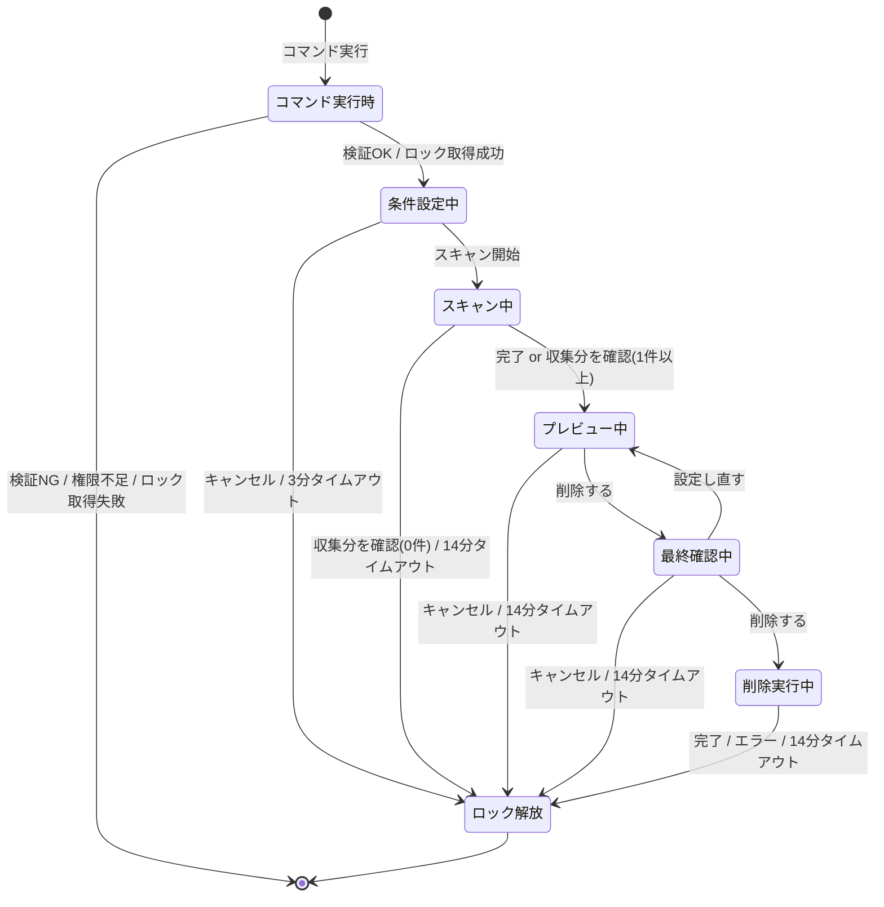
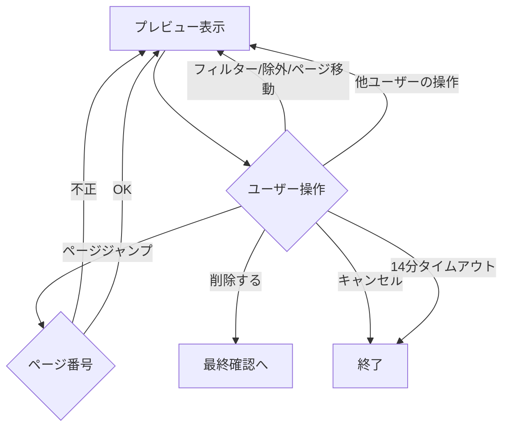
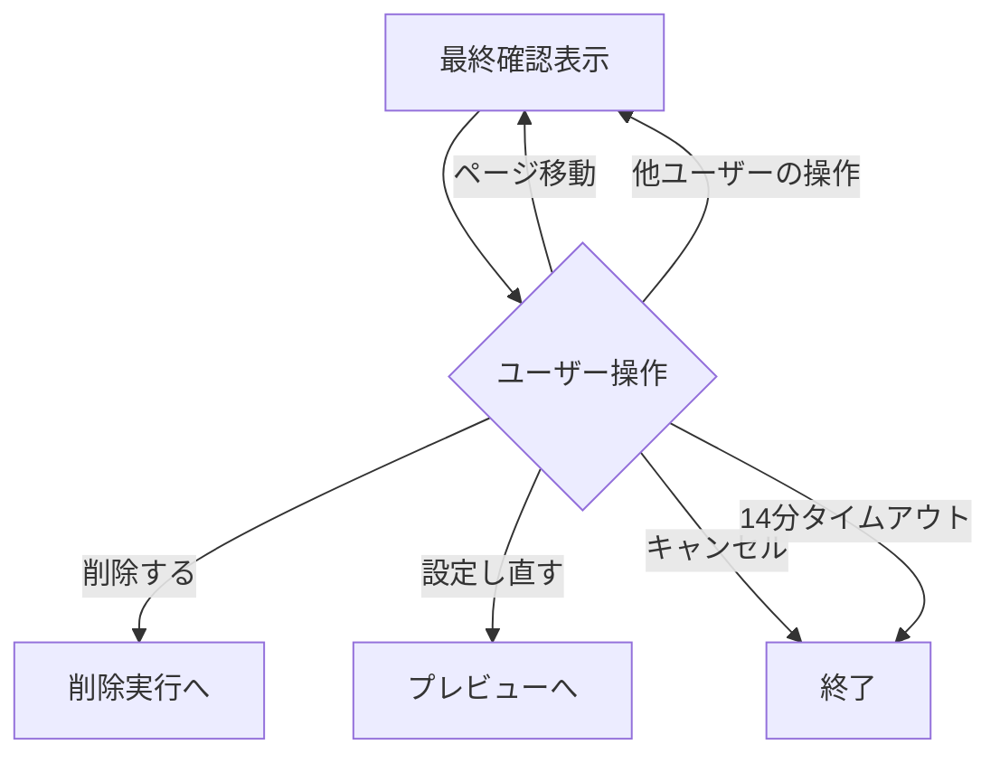
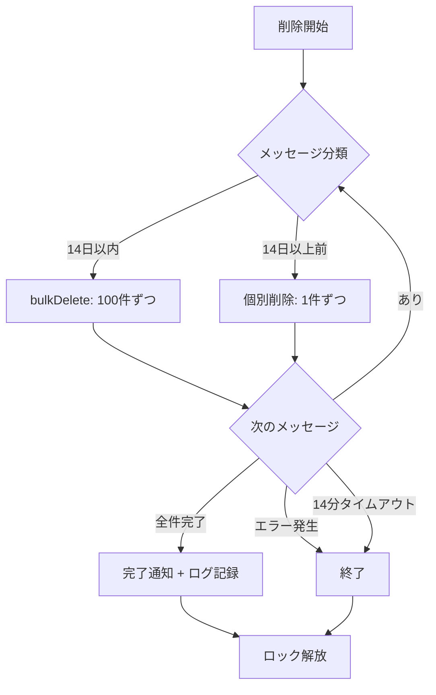

# メッセージ削除機能 - 仕様書

> モデレーター向けメッセージ一括削除

最終更新: 2026年3月18日

---

## 概要

モデレーター権限を持つユーザーが、サーバー内の全チャンネルまたは特定チャンネルにわたって、特定ユーザーのメッセージ・キーワード一致メッセージ・指定件数のメッセージを一括削除できる機能。スパムや不適切なメッセージの迅速な対応を可能にする。

### 機能一覧

| 機能                         | 概要                                                               |
| ---------------------------- | ------------------------------------------------------------------ |
| フィルター条件による絞り込み | ユーザー・キーワード・期間・チャンネルを組み合わせて削除対象を指定 |
| プレビューと除外             | 削除前に対象メッセージを確認し、個別に除外できる                   |
| 削除前の最終確認             | 不可逆操作のため、削除実行前に確認ダイアログを表示                 |
| 処理中ロック                 | サーバー単位で重複実行を防止。実行中は他ユーザーも含め新規実行不可 |

### 権限モデル

| 対象   | 権限                   | 用途                   |
| ------ | ---------------------- | ---------------------- |
| 実行者 | `MANAGE_MESSAGES`      | コマンド実行           |
| Bot    | `MANAGE_MESSAGES`      | メッセージの削除       |
| Bot    | `READ_MESSAGE_HISTORY` | メッセージ履歴の取得   |
| Bot    | `VIEW_CHANNEL`         | チャンネルへのアクセス |

権限不足の場合はエラーメッセージを表示し、ログに記録する。

---

## コマンド定義

**コマンド**: `/message-delete [count] [keyword] [days] [after] [before]`

**実行権限**: `MANAGE_MESSAGES`

**コマンドオプション:**

| オプション名 | 型      | 必須 | 説明                                                                      |
| ------------ | ------- | ---- | ------------------------------------------------------------------------- |
| `count`      | Integer | ❌   | 削除メッセージ数の上限（全チャンネル合計）。1〜1000。未指定時は1000件上限 |
| `keyword`    | String  | ❌   | 本文に対する部分一致検索（case-insensitive）。`user` と AND で併用可      |
| `days`       | Integer | ❌   | 過去N日以内（1〜366）。`after` / `before` と排他                          |
| `after`      | String  | ❌   | この日時以降のメッセージのみ対象。`days` と排他                           |
| `before`     | String  | ❌   | この日時以前のメッセージのみ対象。`days` と排他                           |

条件設定フェーズで追加選択:

| オプション名 | 型                | 必須 | 説明                                                                                                                                                      |
| ------------ | ----------------- | ---- | --------------------------------------------------------------------------------------------------------------------------------------------------------- |
| `user`       | UserSelectMenu    | ❌   | 削除対象ユーザー（最大25人、複数選択可）。Webhook は別途モーダルで ID 入力                                                                                |
| `channel`    | ChannelSelectMenu | ❌   | 対象チャンネル（最大25、複数選択可）。未指定でサーバー全体。対象種別: TextChannel / NewsChannel / Thread / VoiceChannel（テキストチャット機能を持つため） |

**`after` / `before` の日時解釈:**

- `YYYY-MM-DD` → ロケール推定タイムゾーンで解釈（`after` は `00:00:00`、`before` は `23:59:59`）
- `YYYY-MM-DDTHH:MM:SS` → ロケール推定タイムゾーンで解釈
- `YYYY-MM-DDTHH:MM:SS±HH:MM` → 指定オフセットをそのまま適用
- タイムゾーン指定なしの場合は `interaction.locale` から推定（日本語 → JST、UTC 系 → UTC など）
- 未来の日付は指定不可。ただし `YYYY-MM-DD` 形式の当日指定は許可
  - **`after`**: `YYYY-MM-DD` は `00:00:00` と解釈し、その時刻が現在以前なら有効。`YYYY-MM-DDTHH:MM:SS[±HH:MM]` は指定時刻そのものが現在以前なら有効
  - **`before`**: `YYYY-MM-DD` は `23:59:59` と解釈するが、未来判定は `00:00:00` 基準で行う（当日指定を許可するため、`23:59:59` が未来でも `00:00:00` が現在以前なら有効）。`YYYY-MM-DDTHH:MM:SS[±HH:MM]` は指定時刻そのものが現在以前なら有効

---

## 動作フロー



> 全終了パス（正常完了・キャンセル・タイムアウト・エラー・例外）で finally によりロック解放

**処理中ロック:** サーバー単位。同一サーバー内でどのユーザーがロック中でも新たな実行を拒否。メモリ管理のため Bot 再起動で自動クリア

### コマンド実行時

1. オプション検証 → NG ならエラー表示して終了
   - `days` と `after`/`before` 同時指定
   - `after` / `before` の日付形式不正
   - `after` >= `before`
   - `after` / `before` に未来の日付
   - `days` に不正な値
2. 権限チェック（実行者・Bot） → 不足ならエラー表示して終了
3. ロック取得 → 失敗ならエラー表示して終了
4. 条件設定フェーズへ

### 条件設定

- ユーザー/チャンネル選択、Webhook ID 入力（不正形式はエラー表示して再入力）を繰り返し可能
- 「スキャン開始」ボタン押下 → フィルタ条件検証を実行し、OK ならスキャンへ
- キャンセル / 3分タイムアウト → ロック解放して終了

フィルタ条件検証（スキャン開始ボタン押下時）:

- `count`・`user`・`keyword`・`days`・`after`・`before` のいずれも未指定の場合はスキャン開始を拒否
- `channel` のみ指定も拒否（フィルタ条件なしでチャンネル全削除になるため）

**UIコンポーネント:**

| 行  | コンポーネント    | customId                                                                                    | 動作                                                                  |
| --- | ----------------- | ------------------------------------------------------------------------------------------- | --------------------------------------------------------------------- |
| 1   | UserSelectMenu    | `message-delete:select-user`                                                                | 最大25人、複数選択可。`minValues: 0`、`maxValues: 25`                 |
| 2   | ChannelSelectMenu | `message-delete:select-channel`                                                             | 最大25チャンネル、テキストベースのみ。`minValues: 0`、`maxValues: 25` |
| 3   | ボタン×3          | `message-delete:start-scan` / `message-delete:webhook-input` / `message-delete:cond-cancel` | スキャン開始 / Webhook ID 入力モーダル / キャンセル                   |

**Webhook ID 入力モーダル:**

- 「📩 Webhook ID を入力」ボタンから表示
- 受け付け形式: 生のID（17〜20桁の数字）。不正な形式はエラー
- 入力した Webhook ID は対象ユーザーリストに追加

### スキャン

チャンネルリストを構築し、アクセス可能なチャンネルに対して k-way マージでスキャンを実行する。

**状態遷移:**

| 条件                                       | 収集件数 | 次の状態     | 表示メッセージ                                                                                           |
| ------------------------------------------ | -------- | ------------ | -------------------------------------------------------------------------------------------------------- |
| channel 指定時、一部アクセス不可           | —        | スキャン続行 | スキップしたチャンネルを通知                                                                             |
| channel 指定時、全チャンネルアクセス不可   | —        | 終了         | `❌ 指定したチャンネルにアクセスできません。BotにReadMessageHistoryおよびManageMessages権限が必要です。` |
| channel 未指定、アクセス不可チャンネルあり | —        | スキャン続行 | （通知なくスキップ）                                                                                     |
| channel 未指定、全チャンネルアクセス不可   | 0件      | 終了         | `ℹ️ 削除可能なメッセージが見つかりませんでした。`                                                        |
| スキャン正常完了                           | 1件以上  | プレビューへ | （なし、直接遷移）                                                                                       |
| スキャン正常完了                           | 0件      | 終了         | `ℹ️ 削除可能なメッセージが見つかりませんでした。`                                                        |
| 「収集分を確認」ボタン押下                 | 1件以上  | プレビューへ | （なし、直接遷移）                                                                                       |
| 「収集分を確認」ボタン押下                 | 0件      | 終了         | `❌ 削除をキャンセルしました。`                                                                          |
| 14分タイムアウト                           | 1件以上  | プレビューへ | `⌛ スキャンがタイムアウトしました。収集済みのメッセージでプレビューを表示します。`                      |
| 14分タイムアウト                           | 0件      | 終了         | タイムアウトメッセージを表示                                                                             |
| チャンネル・メッセージ削除等による中断     | 1件以上  | プレビューへ | （なし、直接遷移）                                                                                       |
| チャンネル・メッセージ削除等による中断     | 0件      | 終了         | `❌ 削除をキャンセルしました。`                                                                          |
| 例外発生                                   | —        | 終了         | `❌ メッセージの収集中にエラーが発生しました`                                                            |

**k-wayマージアルゴリズム:**

1. `beforeTs` を Discord Snowflake ID に変換（初回フェッチ位置の最適化）
2. 全チャンネルを**並列**で初期フェッチ（`limit: 100, before: beforeSnowflake`）し、チャンネルごとのカーソルを初期化
3. k-wayマージループ（`収集件数 < count` の間）:
   a. キャンセルシグナル確認（「収集分を確認」ボタン押下時に中断）
   b. バッファが空かつ未消耗のチャンネルを追加フェッチ（直列・レートリミット考慮で 200ms 待機）
   c. 全チャンネルのバッファ先頭のうち最新タイムスタンプを持つメッセージを選択
   d. 選択不可ならループ終了（全チャンネル消耗）
   e. user・keyword フィルタ適用、不一致はスキップ（スキャン総件数にはカウント）
   f. 収集リストに追加
4. チャンネル消耗判定: フェッチ結果が0件/100件未満、または最古メッセージが `afterTs` より古い場合は消耗済み。`afterTs` より古いメッセージはバッファから除外
5. `count` 件収集した時点でループ早期終了（全チャンネルスキャン完了前でも停止）

**UIコンポーネント:**

**表示テキスト:**

```
スキャン中... N件
対象メッセージを検索中... M / L件
```

- N: スキャン済み総件数（フィルタ適用前の走査件数）
- M: 条件一致件数
- L: 削除上限件数（`count` 値、未指定時 1000）
- チャンネルごとのフェッチ完了ごとに `editReply` で更新

| 行  | コンポーネント           | customId                     | 動作                                               |
| --- | ------------------------ | ---------------------------- | -------------------------------------------------- |
| 1   | ボタン×1（収集分を確認） | `message-delete:scan-cancel` | スキャン中断。1件以上ならプレビューへ、0件なら終了 |

### 確認（プレビュー ↔ 最終確認）

確認フェーズはプレビュー（Stage 1）と最終確認（Stage 2）の2ステージで構成される。最終確認の「戻る」でプレビューに戻るループ構造。タイムアウトは確認フェーズ全体で共有する。

#### プレビュー（Stage 1）



**Embed 1: コマンド条件（静的）**

| 項目       | 内容                                                                    |
| ---------- | ----------------------------------------------------------------------- |
| タイトル   | `📋 コマンド条件`                                                       |
| カラー     | グレー（`#95a5a6`）                                                     |
| フィールド | コマンドオプションと1:1。全オプションを常に表示、未設定は括弧書きで明示 |

| フィールド名 | 設定ありの例        | 未設定の例                                     |
| ------------ | ------------------- | ---------------------------------------------- |
| `count`      | `500 件`            | `(上限なし: 1000 件)`                          |
| `user`       | `<@ID1> <@ID2> ...` | `(全員対象)`                                   |
| `keyword`    | `"スパム"`          | `(なし)`                                       |
| `days`       | `過去 7 日間`       | —（after/before と排他、設定された方のみ表示） |
| `after`      | `2026-01-01 以降`   | `(なし)`                                       |
| `before`     | `2026-02-01 以前`   | `(なし)`                                       |
| `channel`    | `<#ID1> <#ID2> ...` | `(サーバー全体)`                               |

**Embed 2: 削除対象メッセージ（動的）**

| 項目       | 内容                                                            |
| ---------- | --------------------------------------------------------------- |
| タイトル   | `📋 削除対象メッセージ（N / T ページ）`                         |
| フィールド | メッセージ1件ずつ（5件/ページ）。除外済みは ~~取り消し線~~ 表示 |

- 投稿日時は `<t:unix秒:f>` 形式（Discord が閲覧者のローカル時刻に自動変換）
- 本文は `MSG_DEL_CONTENT_MAX_LENGTH` で省略、末尾に `…`
- フィルター適用状態はボタンの色で確認（未適用: Secondary/グレー、適用中: Primary/青）

**UIコンポーネント:**

| 行  | コンポーネント               | customId                                                                                            | 動作                                                                                 |
| --- | ---------------------------- | --------------------------------------------------------------------------------------------------- | ------------------------------------------------------------------------------------ |
| 1   | ボタン×5（ページネーション） | `message-delete:first` / `prev` / `jump` / `next` / `last`                                          | ページ移動。中央 `1/N` でジャンプモーダル                                            |
| 2   | StringSelectMenu（投稿者）   | `message-delete:filter-author`                                                                      | 投稿者フィルター。選択肢はスキャン全体から収集（フィルター状態に依存しない）         |
| 3   | ボタン×5（フィルター）       | `message-delete:filter-days` / `filter-after` / `filter-before` / `filter-keyword` / `filter-reset` | 各モーダル入力。適用中はラベルに入力値をそのまま表示（例: `📅 after: 2026-01-01`）   |
| 4   | StringSelectMenu（除外）     | `message-delete:confirm-exclude`                                                                    | 現在ページの件を表示。トグルで除外追加/解除。`minValues: 0`、`maxValues: ページ件数` |
| 5   | ボタン×2                     | `message-delete:confirm-yes`（Danger） / `confirm-no`                                               | 最終確認へ / キャンセル→終了                                                         |

**除外の仕様:**

- 除外セットはページをまたいで保持
- 除外済みは Embed フィールド名を ~~取り消し線~~ 表示
- セレクトメニューは除外済みを選択済み状態で表示
- 「削除する（N件）」の N = スキャン結果全体 − 除外セット件数（フィルター状態に依存しない）
- 全件除外時は「削除する」ボタンを無効化
- **フィルターは表示の絞り込みのみ**で削除対象件数には影響しない。フィルター中に「削除する」を押しても表示されていないメッセージも含めて全件（除外分を除く）が削除される

#### 最終確認（Stage 2）



**Embed:**

| 項目       | 内容                                                      |
| ---------- | --------------------------------------------------------- |
| タイトル   | `🗑️ 本当に削除しますか？（N / T ページ）`                 |
| 説明       | `⚠️ **この操作は取り消せません**` + 合計件数              |
| フィールド | メッセージ1件ずつ（5件/ページ）。除外されなかったもののみ |

**UIコンポーネント:**

| 行  | コンポーネント               | customId                                                         | 動作                                      |
| --- | ---------------------------- | ---------------------------------------------------------------- | ----------------------------------------- |
| 1   | ボタン×5（ページネーション） | `message-delete:first` / `prev` / `jump` / `next` / `last`       | ページ移動。中央 `1/N` でジャンプモーダル |
| 2   | ボタン×3                     | `message-delete:final-yes`（Danger） / `final-back` / `final-no` | 削除実行 / プレビューへ戻る / 終了        |

- フィルター・除外操作なし（読み取り専用の確認画面）
- 「◀ 設定し直す」→ プレビューに戻る（除外セット・フィルター状態は保持）
- プレビューで適用していたフィルターは最終確認には引き継がれない

### 削除実行



削除済みメッセージに遭遇した場合はエラーを無視して継続する（ログに警告）。

**削除進捗の表示:**

```
削除中... N / T件
<#チャンネルID>: deleted / total件
<#チャンネルID>: deleted / total件
```

- チャンネルメンション形式（`<#チャンネルID>`）でクリッカブル表示

**完了メッセージ:**

1件以上削除した場合:

```
✅ 削除完了
合計削除件数: 45件

チャンネル別内訳:
  <#チャンネルID>: 20件
  <#チャンネルID>: 15件
  <#チャンネルID>: 10件
```

0件の場合:

```
ℹ️ 削除可能なメッセージが見つかりませんでした。
```

---

## 制約・制限事項

- **削除上限**: 全チャンネル合計で最大1000件（`count` 未指定時）
- **処理中ロック**: サーバー単位。スキャン〜削除実行の間、同一サーバーの全ユーザーが新規実行不可。全終了パスで `finally` により確実に解放。Bot 再起動時は自動クリア
- **bulkDelete の14日制限**: Discord API の制約。14日以内は bulkDelete（100件ずつ、数秒）、14日以上前は個別削除（1件約0.5秒）
- **レート制限**: メッセージフェッチ・削除は100件ずつ分割
- **パフォーマンス目安**: bulkDelete 100件 = 数秒、個別削除 100件 ≈ 50秒、500件 ≈ 250秒（約4分）
- **タイムアウト設計**: ボタン操作の `deferUpdate()` で fresh Interaction token（15分）を取得し、14分（1分バッファ）使える。ステージ遷移のたびにリセットされるため、前のステージ/フェーズの残り時間を引き継がない
  - 条件設定フェーズ: 3分
  - スキャンフェーズ: 14分
  - 確認フェーズ: 各ステージで独立して14分（Stage 1 → Stage 2 の遷移、「戻る」による Stage 1 への復帰でそれぞれ fresh token）。「戻る」でループするたびに14分が再付与されるため、確認フェーズ全体の上限は固定ではない。ただしアイドルタイムアウト（3分無操作）により放置時は打ち切られる
  - 削除実行フェーズ: 14分
  - モーダル操作は各ボタン interaction の fresh token を使用
- **アイドルタイムアウト（3分）**: 確認フェーズのコレクターに設定。エフェメラルメッセージの非表示は `MESSAGE_DELETE` イベントが発生しないため、ロック長時間保持を回避。操作のたびにリセット

---

## ローカライズ

キーの名前空間: `commands:message-delete.*`

実際のキー定義:

- `src/shared/locale/locales/ja/commands.ts`
- `src/shared/locale/locales/en/commands.ts`

---

## 依存関係

| 依存先                                                                                                         | 内容                                     |
| -------------------------------------------------------------------------------------------------------------- | ---------------------------------------- |
| [Discord.js bulkDelete](https://discord.js.org/#/docs/discord.js/main/class/TextChannel?scrollTo=bulkDelete)   | 14日以内のメッセージ一括削除             |
| [Discord API Bulk Delete Messages](https://discord.com/developers/docs/resources/channel#bulk-delete-messages) | bulkDelete の制約（14日制限、100件上限） |

---

## ログ記録

**フォーマット:**

```
[MsgDel] <実行者ID> deleted <合計削除件数> messages [count=<N>] [targets=<対象ユーザーID, ...>] [keyword="<キーワード>"] [days=<N> | after=<日時> before=<日時>] channels=[<チャンネルID, ...>]
```

**例:**

```
[MsgDel] 123456789012345678 deleted 50 messages targets=[567890123456789012] channels=[111, 222]
[MsgDel] 432109876543210987 deleted 100 messages keyword="広告" channels=[111, 333, 444]
[MsgDel] 123456789012345678 deleted 30 messages count=5 targets=[999988887777666655] keyword="spam" channels=[111]
[MsgDel] 432109876543210987 deleted 80 messages targets=[567890123456789012, 111222333444555666] days=7 channels=[111, 222]
[MsgDel] 123456789012345678 deleted 45 messages after=2026-02-01 before=2026-02-27 channels=[111]
```
