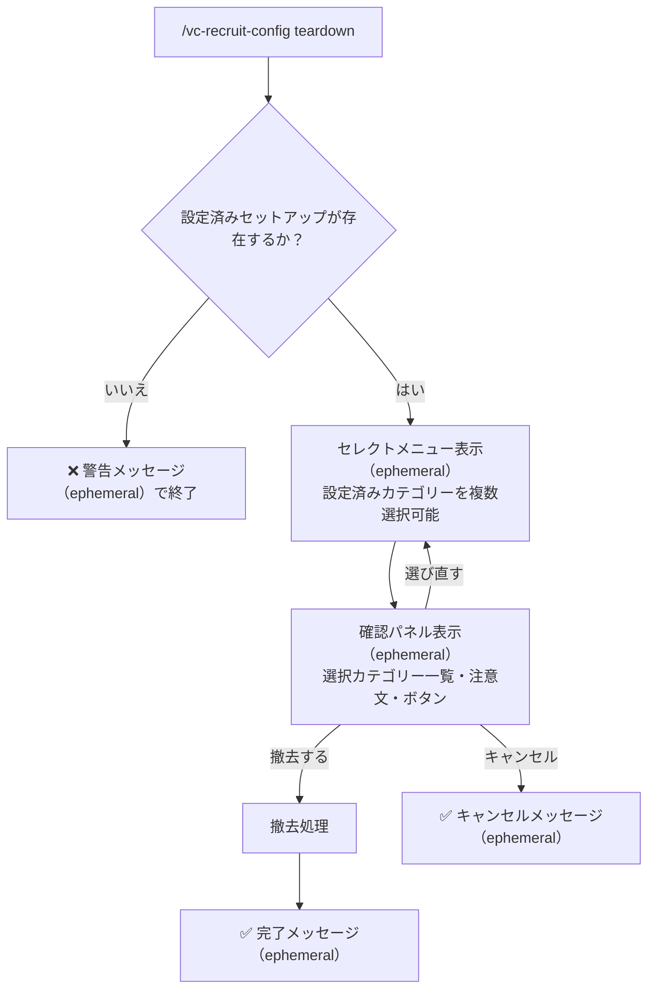

# VC募集機能 (VC Recruit) - 仕様書

> コマンドで専用チャンネルを自動作成し、VC参加者を募るメッセージをモーダルで投稿する機能

最終更新: 2026年3月15日（メンション複数選択対応・add-role/remove-role を複数ロール一括対応に変更・タイムアウト3分化・カスタムIDをコロン区切り形式に統一・応答をEmbed形式に変更）

---

## 概要

コマンドでカテゴリーを指定するだけで、VC募集専用の **募集作成**チャンネル（募集ボタン設置）と **募集一覧**チャンネル（募集メッセージ表示）の2チャンネルを自動作成します。メンバーはパネルのボタンからメンション・募集文・対象VCを設定して投稿でき、投稿には「VCに参加」リンクや管理ボタンが付きます。両チャンネルとも一般ユーザーの直接書き込みは不可で、投稿への返信は Bot が自動作成するスレッド内でのみ可能です。

### 主な用途

- ゲームや雑談など、VCへの参加者を広く呼びかける
- 毎回メンション先やVC名を入力する手間を省く定型フォーマットの提供
- 運営側がメンション対象ロールを制限することで、不要な全体メンションを防止
- 両チャンネルとも直接書き込み不可のため、募集以外の雑談投稿を防止

### 主な機能一覧

| 機能 | 概要 |
| --- | --- |
| チャンネル自動作成 | コマンド1つで募集作成・募集一覧チャンネルをセットで作成 |
| 2ステップ入力 | セレクトメニュー（メンション・VC選択）→ モーダル（募集文）のフロー |
| 新規VC作成 | 既存VC選択のほか「新規VC作成」も選択可能 |
| ロール制限 | メンション候補ロールをサーバー管理者が事前設定 |
| 管理ボタン | 「🎤 VCに参加」「✏️ VC名を変更」「🔇 募集終了」「🗑️ 募集を削除」を募集メッセージに設置 |
| スレッド自動作成 | 募集メッセージごとにスレッドを自動作成。返信はスレッド内のみ |
| カテゴリ絞り込み | VC一覧はセットアップしたカテゴリー内に限定し、誤選択を防止 |

---

## 主要機能

### 1. チャンネルセットアップ

**トリガー**: `/vc-recruit-config setup` コマンド実行

**作成されるチャンネル:**

チャンネル名はギルドの設定言語（`tGuild()`）から自動解決されます。

| 役割     | 翻訳キー                               | `ja`       | `en`              |
| -------- | -------------------------------------- | ---------- | ----------------- |
| 募集作成 | `commands:vcRecruit.channelName.panel` | `募集作成` | `vc-create`       |
| 募集投稿 | `commands:vcRecruit.channelName.post`  | `募集一覧` | `vc-recruit-list` |

**チャンネル権限設定:**

**募集作成チャンネル:**

| 対象         | 権限                                           | 設定値  |
| ------------ | ---------------------------------------------- | ------- |
| `@everyone`  | `SendMessages`                                 | ❌ 拒否 |
| `@everyone`  | `ViewChannel` / `ReadMessageHistory`           | ✅ 許可 |
| Bot のロール | `SendMessages`, `ManageMessages`, `EmbedLinks` | ✅ 許可 |

> `@everyone` の `SendMessages` を拒否しても、ボタン・セレクトメニューなどのインタラクションは実行可能です。

**募集一覧チャンネル:**

| 対象         | 権限                                                                  | 設定値  |
| ------------ | --------------------------------------------------------------------- | ------- |
| `@everyone`  | `SendMessages`                                                        | ❌ 拒否 |
| `@everyone`  | `SendMessagesInThreads`                                               | ✅ 許可 |
| `@everyone`  | `CreatePublicThreads`                                                 | ❌ 拒否 |
| Bot のロール | `SendMessages`, `ManageMessages`, `EmbedLinks`, `CreatePublicThreads` | ✅ 許可 |

> 募集一覧チャンネルには直接書き込み不可。Bot が募集メッセージごとにスレッドを自動作成し、一般ユーザーはそのスレッド内でのみ返信可能です。スレッドは設定の自動アーカイブ時間後にアーカイブ（折りたたみ表示）され、チャンネルが自然に整理されます。

**固有ロールで権限管理しているサーバーへの対応（募集作成チャンネルのみ）:**

サーバーによっては `@everyone` に `ViewChannel` を拒否し、固有ロールに個別付与する権限管理をしている場合があります。この場合、`@everyone` の `SendMessages` だけを拒否しても `ViewChannel` が元々ない状態のため機能しません。

Bot がチャンネルを新規作成する際、Discord はカテゴリーの権限を継承します。**カテゴリーに設定されている権限をそのまま引き継いだうえで**、Bot 自身の `SendMessages` 許可だけを上書き追加します。`@everyone` への明示的な拒否設定は付与しません。

| 状況                                                      | 動作                                                                                           |
| --------------------------------------------------------- | ---------------------------------------------------------------------------------------------- |
| カテゴリーが `@everyone` に `ViewChannel` を許可している  | `@everyone` の `SendMessages` を拒否 ＋ Bot の `SendMessages` を許可                           |
| カテゴリーが固有ロールのみに `ViewChannel` を許可している | カテゴリーの権限をそのまま継承し、Bot の `SendMessages` を許可。`@everyone` への操作は行わない |
| カテゴリーが設定されていない（TOP レベル）                | `@everyone` の `SendMessages` を拒否 ＋ Bot の `SendMessages` を許可                           |

> 要するに「Bot が書けるようにする」だけを追加し、カテゴリーが既に誰を見せるか制御している場合はそれを尊重します。

> 募集一覧チャンネルも募集作成チャンネルと同様、カテゴリー権限を継承して Bot `SendMessages` / `CreatePublicThreads` 許可、`@everyone` `SendMessages` ・`CreatePublicThreads` 拒否、`@everyone` `SendMessagesInThreads` 許可を設定します。固有ロール管理サーバーでは同様に `@everyone` への操作は行わず、`ViewChannel` があるロールはスレッド内で返信できます。

**パネルUI（募集作成 チャンネルに送信）:**

<table border="1" cellpadding="8" width="380">
<tr><th align="left">📝 VC募集</th></tr>
<tr><td><i>Embedカラー: #24B9B8</i></td></tr>
<tr><td>ボタンからVC参加者の募集を作成できます。<br><br><b>作成手順</b><br>1. 下のボタンを押して募集作成を開始します<br>2. メンションするロールと参加するVCを選択します<br>3. 募集内容を入力して送信すると、募集一覧チャンネルに投稿されます</td></tr>
<tr><td><kbd>VC募集を作成</kbd></td></tr>
</table>

> 同一カテゴリーに既にセットアップが存在する場合は再作成不可。別カテゴリーへのセットアップは複数可。

---

### 2. 募集モーダルの表示・入力

**トリガー**: 「VC募集を作成」ボタンの押下

> Discord のモーダルはテキスト入力コンポーネントのみ対応しているため、VC選択・メンション選択は事前のエフェメラルメッセージで行う 2ステップ方式を採用します（詳細は「[インタラクションフロー詳細](#-インタラクションフロー詳細)」参照）。

**ステップ 1 — エフェメラルメッセージ（VC・メンション選択）:**

<table border="1" cellpadding="8" width="420">
<tr><th align="left">📋 ステップ 1/2</th></tr>
<tr><td>メンション・VCを選択してください</td></tr>
<tr><td>
<b>メンション</b>（複数選択可）<br>
<i>セレクトメニュー（複数選択可）<br>
・@ゲーマー募集<br>
・@雑談VC</i>
</td></tr>
<tr><td>
<b>VC</b> <i>必須</i><br>
<i>セレクトメニュー<br>
・🆕 新規VC作成<br>
・🔊 雑談VC<br>
・🔊 ゲームVC</i>
</td></tr>
<tr><td><kbd>📝 内容を入力する</kbd></td></tr>
</table>

**ステップ 2 — モーダル（募集内容入力）:**

既存VC選択時:

<table border="1" cellpadding="8" width="420">
<tr><th align="left">VC募集を作成（2/2）</th></tr>
<tr><td>
<b>募集内容</b> <i>必須</i><br>
<i>テキスト入力 / 最大500文字</i>
</td></tr>
<tr><td><kbd>送信する</kbd></td></tr>
</table>

「🆕 新規VC作成」選択時:

<table border="1" cellpadding="8" width="420">
<tr><th align="left">VC募集を作成（2/2）</th></tr>
<tr><td>
<b>募集内容</b> <i>必須</i><br>
<i>テキスト入力 / 最大500文字</i>
</td></tr>
<tr><td>
<b>新規VC名（任意）</b><br>
<i>テキスト入力 / 最大100文字<br>
未入力時は `{表示名}'s Room`</i>
</td></tr>
<tr><td><kbd>送信する</kbd></td></tr>
</table>

**フィールド仕様:**

| フィールド | ステップ | 種別                 | 必須 | 制約                                                                  |
| ---------- | -------- | -------------------- | ---- | --------------------------------------------------------------------- |
| メンション | 1        | セレクトメニュー（複数選択可） | ❌   | 設定済みロール一覧から複数選択可（`minValues: 0`、`maxValues: 登録ロール数`、最大25件）。未選択時はメンションなし |
| VC         | 1        | セレクトメニュー     | ✅   | 「🆕 新規VC作成」＋セットアップしたカテゴリーの既存VC一覧             |
| 募集内容   | 2        | テキスト入力（段落） | ✅   | 最大500文字                                                           |
| 新規VC名   | 2        | テキスト入力（短）   | ❌   | 最大100文字。「新規VC作成」選択時のVC名。未入力時は `{表示名}'s Room` |

---

### 3. 募集メッセージの投稿

**トリガー**: モーダルの確定（選択完了）

**投稿先**: セットアップで作成した `募集一覧` チャンネル

**投稿メッセージUI:**

@ゲーマー募集 @雑談VC（メンションを複数選択した場合）

<table border="1" cellpadding="8" width="420">
<tr><th align="left">📢 VC募集</th></tr>
<tr><td><i>Embedカラー: #24B9B8</i></td></tr>
<tr><td>
<b>募集内容</b><br>
一緒にApexやりましょう！<br>
ランクマ希望
</td></tr>
<tr><td>
<b>VC</b><br>
#channelId
</td></tr>
<tr><td>
<b>募集者</b>: @Username
</td></tr>
<tr><td><kbd>🎤 VCに参加</kbd>（リンクボタン）　<kbd>✏️ VC名を変更</kbd>　<kbd>🔇 募集終了</kbd>　<kbd>🗑️ 募集を削除</kbd></td></tr>
</table>

> 既存VC選択時・新規VC作成時ともに表示形式は同一です。VC欄の `<#channelId>` は選択または作成したVCのメンションになります。「VCに参加」ボタンは `ButtonStyle.Link` で URL は `https://discord.com/channels/{guildId}/{channelId}` を設定します。「✏️ VC名を変更」「🔇 募集終了」「🗑️ 募集を削除」ボタンのカスタムIDには投稿者IDとVCチャンネルIDを埋め込みます。募集終了後は「VCに参加」「✏️ VC名を変更」「🔇 募集終了」ボタンが除去され、「🔇 募集終了済み」（無効）に置き換わり、Embedタイトルが「📢 VC募集【募集終了】」に更新されます。
> メンションを複数選択した場合、選択したすべてのロールがメッセージ本文の先頭にメンションとして付与されます。

**処理フロー（既存VC選択時）:**

```

1. ボタン押下後にエフェメラルでセレクトメニューを表示
   （メンション選択・VC選択 → 「📝 内容を入力する」ボタン）
   ↓
2. ユーザーが既存VCを選択し「📝 内容を入力する」を押下
   ↓
3. モーダル表示（VC名入力フィールドなし）
   - 募集内容を入力して送信
   ↓
4. 設定されたメンション（ある場合）を付与して 募集一覧 に募集メッセージを送信
   （メッセージには「🎤 VCに参加」「✏️ VC名を変更」「🔇 募集終了」「🗑️ 募集を削除」ボタンを添付）
   ↓
5. 募集メッセージにスレッドを自動作成（スレッド名: `{募集者表示名}の募集` / アーカイブ時間: 設定値）
   ↓
6. エフェメラルメッセージを成功メッセージ＋投稿リンクに更新
   「✅ 募集を投稿しました → 投稿を確認する」

```

**処理フロー（新規VC作成選択時）:**

```

1. ボタン押下後にエフェメラルでセレクトメニューを表示
   （メンション選択・VC選択 → 「📝 内容を入力する」ボタン）
   ↓
2. ユーザーが「🆕 新規VC作成」を選択し「📝 内容を入力する」を押下
   ↓
3. モーダル表示（VC名入力フィールドあり）
   - 募集内容を入力
   - 新規VC名を入力（任意）
   - 送信
   ↓
4. セットアップカテゴリーに新規VCを作成
   - VC名: 入力のある場合は入力内容、ない場合は `{表示名}'s Room`
   - カテゴリー: セットアップカテゴリー
   - 人数制限: なし
   ↓
5. 作成したVCのIDを DB に保存（createdVoiceChannelIds に追加）
   ↓
6. 作成したVCのテキストチャット（チャット）に設定パネルを送信
   ↓
7. 設定されたメンション（ある場合）を付与して 募集一覧 に募集メッセージを送信
   （VCリンクは作成した新規VCのリンク。メッセージには「🎤 VCに参加」「✏️ VC名を変更」「🔇 募集終了」「🗑️ 募集を削除」ボタンを添付）
   ↓
8. 募集メッセージにスレッドを自動作成（スレッド名: `{募集者表示名}の募集` / アーカイブ時間: 設定値）
   ↓
9. エフェメラルメッセージを成功メッセージ＋投稿リンクに更新
   「✅ 募集を投稿しました → 投稿を確認する」

```

---

### 4. 新規作成VCの設定パネル

**配置場所**: 新規作成されたボイスチャンネルのテキストチャット

**パネルUI:**

<table border="1" cellpadding="8" width="380">
<tr><th align="left">🎤 ボイスチャンネル操作パネル</th></tr>
<tr><td>このパネルからVCの設定を変更できます。</td></tr>
<tr><td>
<kbd>✏️ VC名を変更</kbd><br>
<kbd>👥 人数制限を変更</kbd><br>
<kbd>🔇 メンバーをAFKに移動</kbd><br>
<kbd>🔄 パネルを最下部に移動</kbd>
</td></tr>
</table>

**ボタン機能:**

| ボタン                  | 機能             | 実行権限                | 説明                                        |
| ----------------------- | ---------------- | ----------------------- | ------------------------------------------- |
| ✏️ VC名を変更           | Modal表示        | VC参加中の ユーザーのみ | テキスト入力でVC名を変更                    |
| 👥 人数制限を変更       | Modal表示        | VC参加中の ユーザーのみ | 0-99の数値入力で人数制限を変更 （0=無制限） |
| 🔇 メンバーをAFKに移動  | User Select Menu | VC参加中の ユーザーのみ | 複数メンバーを選択して AFKチャンネルに移動  |
| 🔄 パネルを最下部に移動 | パネル再送信     | VC参加中の ユーザーのみ | チャットが流れた際に パネルを最下部に移動   |

> ボタンハンドラーは VAC の操作パネルと共通です。パネルUI・ボタンのカスタムID・VC参加チェックのロジックをそのまま流用します。

> 新規作成VCの名前は募集作成時（ステップ2モーダルの「新規VC名」フィールド）で事前設定できるほか、募集メッセージの「✏️ VC名を変更」ボタンから後から変更することもできます（詳細はセクション7参照）。設定パネルのVC名変更は「VC参加中のユーザーのみ」制限があるため、未参加時は利用できません。

---

### 5. 募集投稿の削除

**トリガー**: 募集メッセージの「🗑️ 募集を削除」ボタン押下

**実行権限**: 投稿者本人 または `MANAGE_CHANNELS` 権限保持者

**削除対象:**

| 対象                         | 条件                                            |
| ---------------------------- | ----------------------------------------------- |
| 募集メッセージ               | 常に削除                                        |
| スレッド                     | 常に削除                                        |
| 新規作成VC                   | `createdVoiceChannelIds` に含まれる場合のみ削除 |
| DB の createdVoiceChannelIds | 新規作成VCを削除した場合、該当IDを削除          |

**処理フロー:**

```

1. 「🗑️ 募集を削除」ボタン押下
   ↓
2. 権限チェック（投稿者 or MANAGE_CHANNELS）
   → 権限なし: 「❌ この操作は投稿者または管理者のみ実行できます」をエフェメラルで表示して終了
   ↓
3. 確認プロンプトをエフェメラルで表示
   【新規作成VCの場合】
   「🗑️ この募集を削除しますか？
    投稿・スレッド・新規作成VCがすべて削除されます。」
   【既存VCの場合】
   「🗑️ この募集を削除しますか？
    投稿・スレッドが削除されます。VCは削除されません。」
   [削除する] [キャンセル]
   ↓
4a. 「削除する」押下
   - VCが createdVoiceChannelIds に含まれる場合:
     DB から該当IDを先に削除（channelDelete ハンドラーのスキップを保証） → VCを削除
   - スレッドを削除
   - 募集メッセージを削除
   - エフェメラルメッセージを「✅ 募集を削除しました」に更新
   ↓
4b. 「キャンセル」押下
   → エフェメラルメッセージを「キャンセルしました」に更新して終了

```

> スレッドは親メッセージを削除しても Discord 上では残るため、明示的に削除します。既存VCを選択した場合はVCの削除は行いません。

---

### 6. 募集終了

**トリガー**: 募集メッセージの「🔇 募集終了」ボタン押下

**実行権限**: 投稿者本人 または `MANAGE_CHANNELS` 権限保持者

**動作:**

| 条件                                       | VCの扱い                                         | 投稿パネルの更新                                                                                                        |
| ------------------------------------------ | ------------------------------------------------ | ----------------------------------------------------------------------------------------------------------------------- |
| VCが `createdVoiceChannelIds` に含まれる   | DB から該当IDを削除 → VCを削除                   | 「VCに参加」「✏️ VC名を変更」「🔇 募集終了」→「🔇 募集終了済み」（無効）、Embedタイトル→「📢 VC募集【募集終了】」 |
| VCが `createdVoiceChannelIds` に含まれない | VCは削除しない（既存VCは他メンバーも利用のため） | 「VCに参加」「✏️ VC名を変更」「🔇 募集終了」→「🔇 募集終了済み」（無効）、Embedタイトル→「📢 VC募集【募集終了】」 |

**処理フロー:**

```

1. 「🔇 募集終了」ボタン押下
   ↓
2. 権限チェック（投稿者 or MANAGE_CHANNELS）
   → 権限なし: 「❌ この操作は投稿者または管理者のみ実行できます」をエフェメラルで表示して終了
   ↓
3. 確認プロンプトをエフェメラルで表示
   【新規作成VCの場合】
   「🔇 募集を終了しますか？
    VCが削除され、募集投稿が終了済みに更新されます。投稿とスレッドは残ります。」
   【既存VCの場合】
   「🔇 募集を終了しますか？
    募集投稿が終了済みに更新されます。VCは削除されません。」
   [終了する] [キャンセル]
   ↓
4a. 「終了する」押下
   - VCが createdVoiceChannelIds に含まれる場合:
     DB から該当IDを先に削除（channelDelete ハンドラーのスキップを保証） → VCを削除
   - 募集メッセージのEmbedタイトルを「📢 VC募集【募集終了】」に更新
   - 募集メッセージのボタン行を更新:
     「VCに参加」「✏️ VC名を変更」「🔇 募集終了」→ 「🔇 募集終了済み」（ButtonStyle.Secondary, disabled）
   - エフェメラルメッセージを「✅ 募集を終了しました」に更新
   ↓
4b. 「キャンセル」押下
   → エフェメラルメッセージを「キャンセルしました」に更新して終了

```

**終了済み状態の投稿メッセージUI:**

@ゲーマー募集（メンション設定がある場合）

<table border="1" cellpadding="8" width="420">
<tr><th align="left">📢 VC募集【募集終了】</th></tr>
<tr><td><i>Embedカラー: #24B9B8</i></td></tr>
<tr><td>
<b>募集内容</b><br>
一緒にApexやりましょう！<br>
ランクマ希望
</td></tr>
<tr><td>
<b>VC</b><br>
#channelId
</td></tr>
<tr><td>
<b>募集者</b>: @Username
</td></tr>
<tr><td><kbd>🔇 募集終了済み</kbd>（無効）　<kbd>🗑️ 募集を削除</kbd></td></tr>
</table>

> 「🔇 募集終了済み」ボタンは `ButtonStyle.Secondary` かつ `disabled: true` で表示します。「🗑️ 募集を削除」ボタンは終了後も有効なまま残します。「✏️ VC名を変更」ボタンは終了後に除去されます。Embedタイトルは「📢 VC募集【募集終了】」に更新され、他のユーザーから一目で募集が終了していることがわかります。

---

### 7. VC名の変更

**トリガー**: 募集メッセージの「✏️ VC名を変更」ボタン押下

**実行権限**: 投稿者本人 または `MANAGE_CHANNELS` 権限保持者

**動作**: モーダルでVC名を入力し、対象VCのチャンネル名を更新する。募集終了後はボタンが除去されるため操作不可。

**処理フロー:**

```

1. 「✏️ VC名を変更」ボタン押下
   ↓
2. 権限チェック（投稿者 or MANAGE_CHANNELS）
   → 権限なし: 「❌ この操作は投稿者または管理者のみ実行できます」をエフェメラルで表示して終了
   ↓
3. モーダル表示（現在のVC名をプリフィル）
   - 「VC名」テキスト入力（最大100文字）
   ↓
4. VCのチャンネル名を更新
   ↓
5. エフェメラルメッセージを「✅ VC名を変更しました」に更新

```

---

### 8. VC選択範囲の設計方針

**VC セレクトメニューの構成**

VC選択肢は「🆕 新規VC作成」を先頭に、続いてセットアップカテゴリー内の既存VCを表示します。

```

[セレクトメニュー]
🆕 新規VC作成（先頭固定）
🔊 雑談VC
🔊 ゲームVC
...

```

| 状況                                              | 挙動                                                                          |
| ------------------------------------------------- | ----------------------------------------------------------------------------- |
| セットアップカテゴリーにVCが存在する              | 「🆕 新規VC作成」＋同一カテゴリーのVC一覧を表示                               |
| セットアップが TOP レベル（カテゴリーなし）の場合 | 「🆕 新規VC作成」＋TOPレベルのVC一覧を表示                                    |
| 同一カテゴリーにVCが存在しない                    | 「🆕 新規VC作成」のみを表示                                                   |
| カテゴリーに VAC トリガーチャンネルが存在する     | そのチャンネルはセレクトメニューから **除外** する（「🆕 新規VC作成」は表示） |

**VAC トリガーチャンネルの除外について**

VAC のトリガーチャンネル（`CreateVC`）は「入室するとVCが自動生成されるチャンネル」です。
VC募集の選択候補としてトリガーチャンネルが選ばれると、意図しない新VCが自動生成され、さらに募集メッセージのリンクからも参加者がトリガーチャンネルへ入室してしまうリスクがあります。
このため、セットアップカテゴリーと同じカテゴリーに VAC トリガーチャンネルが存在する場合は、そのチャンネルをVC選択肢から除外します。

> VAC のトリガーチャンネルIDは `VacConfig.triggerChannelIds` から取得します。

---

## コマンド仕様

### コマンド体系

| コマンド                         | 役割                                                   | 必要権限       |
| -------------------------------- | ------------------------------------------------------ | -------------- |
| `/vc-recruit-config setup`       | 指定カテゴリーに募集作成・募集一覧チャンネルを作成           | `MANAGE_GUILD` |
| `/vc-recruit-config teardown`    | 設定済みカテゴリーを選択して募集チャンネルセットを削除 | `MANAGE_GUILD` |
| `/vc-recruit-config add-role`    | メンション候補に使えるロールを追加                     | `MANAGE_GUILD` |
| `/vc-recruit-config remove-role` | メンション候補からロールを削除                         | `MANAGE_GUILD` |
| `/vc-recruit-config view`        | 現在の設定を確認                                       | `MANAGE_GUILD` |

---

### `/vc-recruit-config setup`

**説明**: 指定カテゴリー（または TOP レベル）に募集作成チャンネル・募集一覧チャンネルを作成します。

**オプション:**

| オプション名     | 型     | 必須 | 説明                                                                                                         |
| ---------------- | ------ | ---- | ------------------------------------------------------------------------------------------------------------ |
| `category`       | String | ❌   | 作成先カテゴリー（`TOP` またはカテゴリー名）。 未指定時はコマンド実行チャンネルのカテゴリー （なければ TOP） |
| `thread-archive` | String | ❌   | 募集スレッドの自動アーカイブ時間。 `1h` / `24h` / `3d` / `1w`。未指定時は `24h`                              |

> **セットアップ制約**: カテゴリーごとに1セットまで。同一カテゴリーに2セット目は作成不可。別カテゴリーへのセットアップは複数可。

**動作:**

1. `category` が指定されていれば、その対象に2チャンネルを作成
2. `category` が未指定なら、コマンド実行チャンネルのカテゴリーを作成先にする（カテゴリーなしなら TOP）
3. 同一カテゴリーに既にセットアップが存在する場合はエラー
4. `tGuild(guildId, "commands:vcRecruit.channelName.panel/post")` でチャンネル名を解決してチャンネルを作成
   - 募集作成チャンネル: @everyone SendMessages 拒否（固有ロール管理サーバーでは拒否なし）、Bot SendMessages / EmbedLinks 許可
   - 募集一覧チャンネル: @everyone SendMessages/CreatePublicThreads 拒否、@everyone SendMessagesInThreads 許可、Bot SendMessages / EmbedLinks / CreatePublicThreads 許可
5. パネルメッセージを送信
6. DB に保存

**実行例:**

```

/vc-recruit-config setup category:TOP
/vc-recruit-config setup category:ゲームカテゴリー
/vc-recruit-config setup

```

**成功時の応答:**

```

✅ VC募集チャンネルを作成しました
募集作成: #募集作成
募集投稿: #募集一覧

```

**エラー時の応答:**

- 既にセットアップ済みの場合：`❌ このカテゴリーには既にVC募集チャンネルが設置されています`

---

### `/vc-recruit-config teardown`

**説明**: セットアップ済みのVC募集チャンネルセットを選択して削除します。オプション引数はなく、選択UIを通じて対象カテゴリーを指定します。

**オプション:** なし

**動作フロー:**



#### ステップ 1: セットアップ存在確認

コマンド実行時、DBからそのギルドの全セットアップ一覧を取得する。

- セットアップが1件も存在しない場合 → ephemeral でエラーメッセージを送信して終了。

<table><tr><td>❌ VC募集チャンネルが設定されていません</td></tr></table>

#### ステップ 2: セレクトメニュー表示

セットアップが1件以上存在する場合、ephemeral メッセージとして StringSelectMenu を送信する。

- **選択肢**: DBに登録されているセットアップを1件1件リスト表示
  - `categoryId` が `null` の場合は `「TOP（カテゴリーなし）」` と表示
  - `categoryId` が存在する場合は Discord API からカテゴリー名を取得して表示（取得失敗時は `「不明なカテゴリー（ID: xxx）」` として表示）
- **複数選択**: 有効（`minValues: 1`、`maxValues: セットアップ件数`、Discord上限は25）
- **プレースホルダー**: `「撤去するカテゴリーを選択してください」`
- **タイムアウト**: 60秒。期限切れ後はメッセージを更新してセレクトメニューを無効化する

<table>
  <tr><td>撤去するカテゴリーを選択してください ▼</td></tr>
  <tr><td>☑ TOP（カテゴリーなし）</td></tr>
  <tr><td>☑ ゲームカテゴリー</td></tr>
  <tr><td>☐ 雑談カテゴリー</td></tr>
</table>

#### ステップ 3: 確認パネル表示

ユーザーがセレクトメニューで選択を確定させると、同じ ephemeral メッセージを確認パネルに更新する。

**確認パネルの内容（Embed）:**

- タイトル: `「VC募集チャンネルを撤去しますか？」`
- フィールド: 選択されたカテゴリー一覧（各行に `・カテゴリー名`）
- 注意文: `「選択したカテゴリーの募集作成チャンネル・募集一覧チャンネルが削除されます。この操作は取り消せません。」`

**ボタン:**

| ボタン     | スタイル  | カスタムID プレフィックス                  |
| ---------- | --------- | ------------------------------------------ |
| 撤去する   | Danger    | `vc-recruit:teardown-confirm:<sessionId>` |
| 選び直す   | Secondary | `vc-recruit:teardown-redo:<sessionId>`    |
| キャンセル | Secondary | `vc-recruit:teardown-cancel:<sessionId>`  |

- **タイムアウト**: 60秒。期限切れ後はメッセージを更新してボタンを無効化する

<table>
  <tr><th colspan="2">VC募集チャンネルを撤去しますか？</th></tr>
  <tr><td>対象カテゴリー</td><td>・TOP（カテゴリーなし）<br>・ゲームカテゴリー</td></tr>
  <tr><td colspan="2">⚠️ 選択したカテゴリーの募集作成チャンネル・募集一覧チャンネルが削除されます。この操作は取り消せません。</td></tr>
  <tr><td><button>🗑️ 撤去する</button></td><td><button>選び直す</button></td><td><button>キャンセル</button></td></tr>
</table>

#### ステップ 4a: 撤去処理（「撤去する」押下時）

選択されたカテゴリーごとに以下を順番に実行する。途中でエラーが発生した場合は該当カテゴリーをスキップしてエラー内容を記録、全件処理後にまとめてエラー報告する。

1. DB のセットアップレコードを削除（**先に行う**ことで `messageDelete` / `channelDelete` の自己修復ループを防ぐ）
2. 募集作成チャンネルのパネルメッセージを削除（存在する場合）
3. 募集作成チャンネルを削除（既に削除済みの場合はスキップ）
4. 募集一覧チャンネルを削除（既に削除済みの場合はスキップ）

**完了メッセージ（同一 ephemeral メッセージを更新）:**

```
✅ VC募集チャンネルを撤去しました

🗑️ ゲームカテゴリー
🗑️ TOP（カテゴリーなし）
```

エラーが発生したカテゴリーがある場合は、完了メッセージの末尾に追記:

```
⚠️ 以下のカテゴリーで一部エラーが発生しました：
・雑談カテゴリー：チャンネルの削除に失敗しました（権限不足）
```

<table>
  <tr><td>✅ VC募集チャンネルを撤去しました<br><br>🗑️ TOP（カテゴリーなし）<br>🗑️ ゲームカテゴリー</td></tr>
</table>

<table>
  <tr><td>✅ VC募集チャンネルを撤去しました<br><br>🗑️ ゲームカテゴリー<br><br>⚠️ 以下のカテゴリーで一部エラーが発生しました：<br>・雑談カテゴリー：チャンネルの削除に失敗しました（権限不足）</td></tr>
</table>

#### ステップ 4b: キャンセル（「キャンセル」押下時）

処理を中止し、同一 ephemeral メッセージを更新する。

<table><tr><td>キャンセルしました</td></tr></table>

#### ステップ 4c: 選び直す（「選び直す」押下時）

確認セッションを削除し、DB からセットアップ情報を再取得してセレクトメニューを再構築、同一 ephemeral メッセージをステップ2のセレクトメニューへ戻す。

60秒後にセレクトメニューを無効化する。

**エラー時の応答（ステップ1）:**

- セットアップが存在しない場合：`❌ VC募集チャンネルが設定されていません`

---

### `/vc-recruit-config add-role`

**説明**: モーダルのメンション一覧に使用できるロールを追加します。`RoleSelectMenu`（検索対応）で複数ロールを一括追加できます。

**オプション:** なし（スラッシュコマンドオプションではなく、エフェメラルの `RoleSelectMenu` で選択）

**動作フロー:**

1. コマンド実行 → エフェメラルで `RoleSelectMenu`（複数選択可、`maxValues: 25`）を表示
2. ユーザーがロールを選択し「追加する」ボタンを押下
3. 既に登録済みのロールはスキップし、未登録のロールのみ DBの `mentionRoleIds` に追加
4. 追加結果を表示

**エフェメラル UI:**

<table border="1" cellpadding="8" width="420">
<tr><th align="left">📋 メンション候補に追加するロールを選択してください</th></tr>
<tr><td>
<i>[ロールを選択 ▼]（RoleSelectMenu / 検索対応 / 複数選択可・最大25件）</i>
</td></tr>
<tr><td><kbd>✅ 追加する</kbd> &nbsp; <kbd>❌ キャンセル</kbd></td></tr>
</table>

- **タイムアウト**: 3分（180秒）。期限切れ後はセレクトメニュー・ボタンを無効化する

**成功時の応答:**

成功時は Embed で結果を表示する。選択したロールのうち新規追加分・既に登録済みの分を区別せず、すべてを「登録したロール」フィールドに `, ` 区切りで表示する。

<table border="1" cellpadding="8" width="420">
<tr><th align="left">✅ ロールの登録に成功</th></tr>
<tr><td><b>登録したロール</b><br>@ゲーマー募集, @雑談VC</td></tr>
</table>

> 一部のロールが25件上限に達して追加できなかった場合は、成功 Embed に加えて別のエラー Embed で上限超過のロールを `, ` 区切りで表示する。

<table border="1" cellpadding="8" width="520">
<tr><th align="left">❌ 上限超過でロールの登録に失敗</th></tr>
<tr><td>メンション候補ロールの登録上限(25件)に達したため、以下のロールは登録できませんでした。<br><br><b>登録できなかったロール</b><br>@ロールA, @ロールB</td></tr>
</table>

**キャンセル時の応答:** `キャンセルしました`

**エラー時の応答:**

- ロール数上限（25件）超過で全て追加不可の場合：エラー Embed で失敗ロールを表示

---

### `/vc-recruit-config remove-role`

**説明**: モーダルのメンション一覧からロールを削除します。登録済みロールの `StringSelectMenu` で複数ロールを一括削除できます。

**オプション:** なし（スラッシュコマンドオプションではなく、エフェメラルの `StringSelectMenu` で選択）

**動作フロー:**

1. コマンド実行 → DBから登録済みロール一覧を取得
2. 登録済みロールが0件の場合はエラーメッセージを表示して終了
3. エフェメラルで `StringSelectMenu`（複数選択可）を表示（選択肢: 登録済みロール一覧）
4. ユーザーがロールを選択し「削除する」ボタンを押下
5. 選択されたロールを DBの `mentionRoleIds` から削除
6. 削除結果を表示

**エフェメラル UI:**

<table border="1" cellpadding="8" width="420">
<tr><th align="left">📋 メンション候補から削除するロールを選択してください</th></tr>
<tr><td>
<i>[ロールを選択 ▼]（StringSelectMenu / 複数選択可）<br>
・@ゲーマー募集<br>
・@雑談VC</i>
</td></tr>
<tr><td><kbd>🗑️ 削除する</kbd> &nbsp; <kbd>❌ キャンセル</kbd></td></tr>
</table>

- **タイムアウト**: 3分（180秒）。期限切れ後はセレクトメニュー・ボタンを無効化する

**成功時の応答:**

成功時は Embed で結果を表示する。選択したすべてのロールを「削除したロール」フィールドに `, ` 区切りで表示する。

<table border="1" cellpadding="8" width="420">
<tr><th align="left">✅ ロールの削除に成功</th></tr>
<tr><td><b>削除したロール</b><br>@ゲーマー募集, @雑談VC</td></tr>
</table>

**キャンセル時の応答:** `キャンセルしました`

**エラー時の応答:**

- 登録済みロールが0件の場合：`❌ メンション候補にロールが登録されていません`

---

### `/vc-recruit-config view`

**説明**: 現在のVC募集設定を表示します。

**オプション:** なし

**表示内容例:**

<table border="1" cellpadding="8" width="420">
<tr><th align="left">🎤 VC募集設定</th></tr>
<tr><td>
<b>セットアップ済みカテゴリー</b><br>
• ゲームカテゴリー
<table border="0" cellpadding="0" cellspacing="2"><tr><td>募集作成</td><td>: #募集作成</td></tr><tr><td>募集投稿</td><td>: #募集一覧</td></tr></table>
• TOP レベル
<table border="0" cellpadding="0" cellspacing="2"><tr><td>募集作成</td><td>: #募集作成</td></tr><tr><td>募集投稿</td><td>: #募集一覧</td></tr></table>
</td></tr>
<tr><td>
<b>メンション候補ロール</b><br>
@ゲーマー募集, @雑談VC
</td></tr>
</table>

---

## データモデル

設定情報は `GuildConfig.vcRecruitConfig` に JSON 文字列として保存します。

### `VcRecruitConfig` フィールド

| フィールド       | 型               | デフォルト | 説明                                               |
| ---------------- | ---------------- | ---------- | -------------------------------------------------- |
| `enabled`        | boolean          | `true`     | 機能の有効/無効                                    |
| `mentionRoleIds` | string[]         | `[]`       | モーダルのメンション選択肢に表示するロールIDの一覧 |
| `setups`         | VcRecruitSetup[] | `[]`       | セットアップ済みの募集チャンネルセット一覧         |

### `VcRecruitSetup` フィールド

| フィールド               | 型                          | デフォルト | 説明                                                                                                                     |
| ------------------------ | --------------------------- | ---------- | ------------------------------------------------------------------------------------------------------------------------ |
| `categoryId`             | string \| null              | —          | セットアップしたカテゴリーのID。TOP レベル（カテゴリーなし）の場合は `null`                                              |
| `panelChannelId`         | string                      | —          | 募集作成チャンネル（募集作成）のID                                                                                       |
| `postChannelId`          | string                      | —          | 募集一覧チャンネルのID                                                                                       |
| `panelMessageId`         | string                      | —          | パネルメッセージのID                                                                                                     |
| `threadArchiveDuration`  | 60 \| 1440 \| 4320 \| 10080 | `1440`     | 募集スレッドの自動アーカイブまでの時間（分）。Discord の許容値: 60（1時間）/ 1440（24時間）/ 4320（3日）/ 10080（1週間） |
| `createdVoiceChannelIds` | string[]                    | `[]`       | 「新規VC作成」で作成したVCのID一覧。「🔇 募集終了」または「🗑️ 募集を削除」ボタンで明示的に削除される                     |

---

## インタラクションフロー詳細

Discord のモーダルはテキスト入力コンポーネント（`TextInputComponent`）のみ対応しているため、セレクトメニューをモーダルに含めることができません。そのため以下の 2ステップ方式を採用します。

### ステップ 1: セレクトメニュー（エフェメラル）

ボタン押下 → エフェメラルメッセージでセレクトメニューを表示。

```
📋 ステップ 1/2
メンション・VCを選択してください

メンション（複数選択可）
[セレクトメニュー: @ゲーマー募集 / @雑談VC ...]（minValues: 0, maxValues: 登録ロール数）

VC
[セレクトメニュー: 🆕 新規VC作成 / 🔊 雑談VC / 🔊 ゲームVC ...]

[📝 内容を入力する]
```

### ステップ 2: テキスト入力モーダル

「📝 内容を入力する」ボタン押下 → モーダル表示。VC選択状態によってフィールドが変わる。

```
「VC募集を作成（2/2）」
──────────────────────────────────
募集内容 *
[テキスト入力 / 最大500文字]

── 「🆕 新規VC作成」選択時のみ ──
新規VC名（任意）
[テキスト入力 / 最大100文字]
```

---

## エラーハンドリング

| 状況                                             | 応答内容                                                                                                     |
| ------------------------------------------------ | ------------------------------------------------------------------------------------------------------------ |
| チャンネルが削除されてもDBにレコードが残っている | `channelDelete` イベントでペアチャンネルも削除し DB を自動クリーンアップ（詳細は後述）                       |
| VC選択後、対象VCが削除済み                       | `❌ 選択したVCは既に削除されています` をエフェメラルで表示                                                   |
| メンションロールが削除済でDBに残っている         | ロール取得失敗時はセレクトメニューに表示せず、非同期でDBからも削除                                           |
| 新規VC作成時にカテゴリーのチャンネル数が上限超過 | `❌ カテゴリーのチャンネル数が上限（50）に達しているため作成できません` を通知                               |
| 削除ボタンを権限のないユーザーが押した           | `❌ この操作は投稿者または管理者のみ実行できます` をエフェメラルで表示                                       |
| 募集終了ボタンを権限のないユーザーが押した         | `❌ この操作は投稿者または管理者のみ実行できます` をエフェメラルで表示                                       |
| VC名変更ボタンを権限のないユーザーが押した       | `❌ この操作は投稿者または管理者のみ実行できます` をエフェメラルで表示                                       |
| 募集投稿後に新規作成VCが手動削除された           | `channelDelete` イベントで `createdVoiceChannelIds` から削除し、投稿を「募集終了済み」状態に更新（詳細は後述） |
| 募集投稿後に既存VCが手動削除された               | 「🔇 募集終了」ボタン押下時にVCが存在しない場合、VCなし状態として「募集終了済み」扱いで投稿を更新する          |
| VC名変更時に対象VCが既に削除済み                 | `❌ 対象のVCは既に削除されています` をエフェメラルで表示して終了                                              |

---

## 自動クリーンアップ・自己修復

### 募集作成/募集一覧チャンネル削除時（channelDelete イベント）

募集作成チャンネルまたは募集一覧チャンネルが手動削除されると、`channelDelete` イベントハンドラーがペアのチャンネルも削除し、DB のセットアップレコードを自動クリーンアップする。

| 削除されたチャンネル | 動作                                             |
| -------------------- | ------------------------------------------------ |
| 募集作成チャンネル     | 募集一覧チャンネルを削除 → DB のセットアップを削除   |
| 募集一覧チャンネル       | 募集作成チャンネルを削除 → DB のセットアップを削除 |

- ペアのチャンネルが既に削除済みの場合はスキップ（エラーにならない）
- teardown コマンドは DB 削除を先に行うため、teardown 中の `channelDelete` 発火は DB にレコードがなくスキップされる（ループなし）

### パネルメッセージ削除時（messageDelete イベント）

パネルメッセージが手動削除されると、`messageDelete` イベントハンドラーが同チャンネルに新しいパネルメッセージを再送信し、DB の `panelMessageId` を自動更新する。

1. 削除されたメッセージのチャンネルが `panelChannelId` として DB に登録されているか確認
2. 削除されたメッセージの ID が DB の `panelMessageId` と一致するか確認
3. 募集作成チャンネルに同内容のパネルメッセージを再送信
4. DB の `panelMessageId` を新しいメッセージ ID で更新

- teardown で DB を先に削除するため、teardown 中の `messageDelete` 発火は DB にレコードがなくスキップされる（再送信ループなし）
- ボタンの `customId` にはチャンネル ID が埋め込まれているため、再送信後も機能する

### 作成VCの手動削除時（channelDelete イベント）

`createdVoiceChannelIds` に含まれるVCが手動削除されると、`channelDelete` イベントハンドラーが以下を実行する。

1. `createdVoiceChannelIds` から該当VCのIDを削除（DB更新）
2. 募集一覧チャンネルをスキャンし、カスタムIDに該当VCのIDを含む募集メッセージを特定
3. 該当メッセージのEmbedタイトルを「📢 VC募集【募集終了】」に更新し、ボタン行を「募集終了済み」状態に更新（「🔇 募集終了」→「🔇 募集終了済み」（無効）、「VCに参加」「✏️ VC名を変更」ボタンを除去）

> 既存VCが手動削除された場合はチャンネルIDをカスタムIDに持たないため自動更新は行わず、「🔇 募集終了」ボタン押下時にVCの存在確認を行い「募集終了済み」扱いで更新します。

---

## 実装詳細

### モジュール構成

`src/bot/features/vc-recruit/` 配下にコマンド・ハンドラー・リポジトリの3層で構成されます。

- **commands/**: `/vc-recruit-config` の各サブコマンド処理（setup・teardown・add-role・remove-role・view）
- **handlers/ui/**: ボタン・モーダル・セレクトメニューのインタラクションハンドラー、セッション管理
- **handlers/**: `channelDelete`（ペアチャンネル削除・DB自動クリーンアップ）、`messageDelete`（パネルメッセージ再送信・DB更新）
- **repositories/**: 設定の読み書き

> 設定パネルのEmbed・ボタン・ボタンハンドラー（VC名変更・人数制限・AFK移動・パネル再送信）はVACの操作パネルと共通コンポーネントを使用します。

### インタラクション一覧

VC募集機能で使用するボタン・セレクトメニュー・モーダルの操作種類です。

**パネル（募集作成チャンネル）:**

| 操作 | 種別 | 説明 |
| ---- | ---- | ---- |
| VC募集を作成 | ボタン | エフェメラルでステップ1を表示 |

**ステップ1エフェメラル:**

| 操作 | 種別 | 説明 |
| ---- | ---- | ---- |
| メンション選択 | セレクトメニュー（複数選択可） | メンション候補ロールを複数選択（`minValues: 0`） |
| VC選択 | セレクトメニュー | 既存VCまたは新規VC作成を選択 |
| 内容を入力する | ボタン | 選択内容を確定してモーダルを表示 |

**ステップ2モーダル:**

| 操作 | 種別 | 説明 |
| ---- | ---- | ---- |
| 募集作成モーダル（既存VC用） | モーダル | 募集内容のみ入力 |
| 募集作成モーダル（新規VC用） | モーダル | 募集内容 ＋ VC名（任意）を入力 |

**募集メッセージのボタン:**

| 操作 | 種別 | 説明 |
| ---- | ---- | ---- |
| VCに参加 | リンクボタン | 対象VCへのディープリンク |
| VC名を変更 | ボタン | 権限チェック後にVC名変更モーダルを表示 |
| 募集終了 | ボタン | 権限チェック後に確認プロンプトを表示 |
| 募集終了（確認） | ボタン×2 | 「終了する」「キャンセル」 |
| 募集を削除 | ボタン | 権限チェック後に確認プロンプトを表示 |
| 募集を削除（確認） | ボタン×2 | 「削除する」「キャンセル」 |

**teardown フロー:**

| 操作 | 種別 | 説明 |
| ---- | ---- | ---- |
| カテゴリー選択 | セレクトメニュー | 撤去対象カテゴリーの複数選択 |
| 撤去する | ボタン | 撤去処理を実行 |
| 選び直す | ボタン | セレクトメニューへ戻る |
| キャンセル | ボタン | 処理を中止 |

**新規作成VCの設定パネル（VACと共通）:**

| 操作 | 種別 | 説明 |
| ---- | ---- | ---- |
| VC名を変更 | ボタン | VC参加中ユーザーのみ。VC名変更モーダルを表示 |
| 人数制限を変更 | ボタン | VC参加中ユーザーのみ。人数制限変更モーダルを表示 |
| メンバーをAFKに移動 | ユーザーセレクトメニュー | VC参加中ユーザーのみ。複数メンバーを選択してAFKへ移動 |
| パネルを最下部に移動 | ボタン | VC参加中ユーザーのみ。パネルを再送信 |

---

### チャンネル名の多言語対応

チャンネル名はギルドの設定言語から自動解決されます（`ja`：`募集作成` / `募集一覧`、`en`：`vc-create` / `vc-recruit-list`）。

---

## 制約・制限事項

| 項目                         | 制限値・ルール                                                                                                                |
| ---------------------------- | ----------------------------------------------------------------------------------------------------------------------------- |
| セットアップ数               | カテゴリーごとに1セット（サーバー内は複数カテゴリー可）                                                                       |
| メンション候補ロール数       | 最大25件（セレクトメニューの上限）。add-role で複数一括追加可、remove-role で複数一括削除可                                    |
| 募集内容の文字数             | 最大500文字                                                                                                                   |
| VC選択肢の上限               | 「🆕 新規VC作成」1件 ＋ 既存VC最大24件 （計25件）。超過分はサーバーのチャンネル位置順で上位24件を表示し、それ以降は表示しない |
| 募集作成フローのタイムアウト | Bot 側で 14分 に設定（Discord の `InteractionCollector` 上限は15分）。期限切れ後はセレクトメニュー・ボタンを無効化            |
| 新規VC名                     | ユーザー入力値（最大100文字）。 未入力時は `{表示名}'s Room`                                                                  |
| 新規VCの削除                 | 「🔇 募集終了」または「🗑️ 募集を削除」ボタンによる明示的な削除のみ（自動削除なし）                                            |
| スレッド自動アーカイブ       | `1h`(60) / `24h`(1440, デフォルト) / `3d`(4320) / `1w`(10080)。 setup コマンドの `thread-archive` で設定                      |

---

## 関連機能

- **VAC (VC自動作成)**: vc-recruit は `voiceStateUpdate` による空VC自動削除を行わないため、VAC の自動削除処理とは干渉しません。vc-recruit で作成したVCの設定パネルは VAC の操作パネルと共通コンポーネントを使用します
- **StickyMessage**: 両チャンネルとも一般ユーザーの直接投稿が発生しないため、StickyMessage と競合しません
