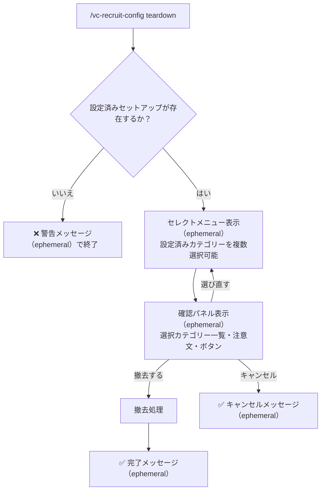

# VC募集機能 (VC Recruit) - 仕様書

> コマンドで専用チャンネルを自動作成し、VC参加者を募るメッセージをモーダルで投稿する機能

最終更新: 2026年3月21日

---

## 概要

コマンドでカテゴリーを指定するだけで、VC募集専用の **募集作成**チャンネル（募集ボタン設置）と **募集一覧**チャンネル（募集メッセージ表示）の2チャンネルを自動作成します。メンバーはパネルのボタンからメンション・募集文・対象VCを設定して投稿でき、投稿には「VCに参加」リンクや管理ボタンが付きます。両チャンネルとも一般ユーザーの直接書き込みは不可で、投稿への返信は Bot が自動作成するスレッド内でのみ可能です。

### 主な用途

- ゲームや雑談など、VCへの参加者を広く呼びかける
- 毎回メンション先やVC名を入力する手間を省く定型フォーマットの提供
- 運営側がメンション対象ロールを制限することで、不要な全体メンションを防止
- 両チャンネルとも直接書き込み不可のため、募集以外の雑談投稿を防止

### 機能一覧

| 機能 | 概要 |
| --- | --- |
| VC自動作成（募集ボタン経由） | 2ステップ入力（セレクトメニュー→モーダル）で募集メッセージを投稿。新規VC作成も選択可能 |
| 募集終了 | 募集メッセージの「🔇 募集終了」ボタンで募集を終了済みに更新。新規作成VCは削除 |
| 募集削除 | 募集メッセージの「🗑️ 募集を削除」ボタンで募集メッセージ・スレッド・新規作成VCを削除 |
| VC名変更 | 募集メッセージの「✏️ VC名を変更」ボタンでVC名をモーダルから変更 |
| 自動クリーンアップ | チャンネル・パネルメッセージ・作成VCの手動削除を検知し自動修復 |
| `/vc-recruit-config setup` | 指定カテゴリーに募集作成・募集一覧チャンネルをセットで作成 |
| `/vc-recruit-config teardown` | 設定済みカテゴリーを選択して募集チャンネルセットを削除 |
| `/vc-recruit-config add-role` | メンション候補に使えるロールを追加 |
| `/vc-recruit-config remove-role` | メンション候補からロールを削除 |
| `/vc-recruit-config view` | 現在の設定を確認 |

### 権限モデル

| 対象 | 権限 | 用途 |
| --- | --- | --- |
| 実行者（config コマンド） | `MANAGE_GUILD` | setup / teardown / add-role / remove-role / view の実行 |
| 実行者（募集操作ボタン） | 投稿者本人 または `MANAGE_CHANNELS` | 募集終了・募集削除・VC名変更の実行 |
| 実行者（設定パネルボタン） | VC参加中のユーザーのみ | VC名変更・人数制限変更・AFK移動・パネル再送信 |
| Bot | `SendMessages`, `ManageMessages`, `EmbedLinks`, `CreatePublicThreads`, `ManageThreads`, `ManageChannels` | チャンネル作成・メッセージ送信・スレッド作成・スレッド管理・チャンネル削除 |

> Bot に上記の権限が不足している場合、インタラクション経由の操作では Bot権限不足エラー（共通フォーマット）を返します。詳細は [MESSAGE_RESPONSE_SPEC.md](MESSAGE_RESPONSE_SPEC.md) を参照。

---

## VC自動作成（募集ボタン経由）

### トリガー

**イベント**: 「VC募集を作成」ボタンの押下（募集作成チャンネルのパネルに設置）

**発火条件:**

- 募集作成チャンネルのパネルにある「VC募集を作成」ボタンが押下される

### 動作フロー

**ステップ 1 — エフェメラルメッセージ（VC・メンション選択）:**

> Discord のモーダルはテキスト入力コンポーネントのみ対応しているため、VC選択・メンション選択は事前のエフェメラルメッセージで行う 2ステップ方式を採用します。

1. ボタン押下後にエフェメラルでセレクトメニューを表示（メンション選択・VC選択 → 「📝 内容を入力する」ボタン）

**ステップ 2 — モーダル（募集内容入力）:**

**処理フロー（既存VC選択時）:**

```

1. ボタン押下後にエフェメラルでセレクトメニューを表示
   （メンション選択・VC選択 → 「📝 内容を入力する」ボタン）
   ↓
2. ユーザーが既存VCを選択し「📝 内容を入力する」を押下
   ↓
3. モーダル表示（VC名入力フィールドなし）
   - 募集内容を入力して送信
   ↓
4. 設定されたメンション（ある場合）を付与して 募集一覧 に募集メッセージを送信
   （メッセージには「🎤 VCに参加」「✏️ VC名を変更」「🔇 募集終了」「🗑️ 募集を削除」ボタンを添付）
   ↓
5. 募集メッセージにスレッドを自動作成（スレッド名: `{募集者表示名}の募集` / アーカイブ時間: 設定値）
   ↓
6. エフェメラルメッセージを成功メッセージ＋投稿リンクに更新
   「✅ 募集を投稿しました → 投稿を確認する」

```

**処理フロー（新規VC作成選択時）:**

```

1. ボタン押下後にエフェメラルでセレクトメニューを表示
   （メンション選択・VC選択 → 「📝 内容を入力する」ボタン）
   ↓
2. ユーザーが「🆕 新規VC作成」を選択し「📝 内容を入力する」を押下
   ↓
3. モーダル表示（VC名入力フィールドあり）
   - 募集内容を入力
   - 新規VC名を入力（任意）
   - 送信
   ↓
4. セットアップカテゴリーに新規VCを作成
   - VC名: 入力のある場合は入力内容、ない場合は `{表示名}'s Room`
   - カテゴリー: セットアップカテゴリー
   - 人数制限: なし
   ↓
5. 作成したVCのIDを DB に保存（createdVoiceChannelIds に追加）
   ↓
6. 作成したVCのテキストチャット（チャット）に設定パネルを送信
   ↓
7. 設定されたメンション（ある場合）を付与して 募集一覧 に募集メッセージを送信
   （VCリンクは作成した新規VCのリンク。メッセージには「🎤 VCに参加」「✏️ VC名を変更」「🔇 募集終了」「🗑️ 募集を削除」ボタンを添付）
   ↓
8. 募集メッセージにスレッドを自動作成（スレッド名: `{募集者表示名}の募集` / アーカイブ時間: 設定値）
   ↓
9. エフェメラルメッセージを成功メッセージ＋投稿リンクに更新
   「✅ 募集を投稿しました → 投稿を確認する」

```

**ビジネスルール:**

- VC選択肢は「🆕 新規VC作成」を先頭に、続いてセットアップカテゴリー内の既存VCを表示
- セットアップカテゴリーにVCが存在しない場合は「🆕 新規VC作成」のみ表示
- セットアップが TOP レベル（カテゴリーなし）の場合は TOPレベルのVC一覧を表示
- 同一カテゴリーに VAC トリガーチャンネルが存在する場合は、そのチャンネルをVC選択肢から除外（VAC のトリガーチャンネルIDは `VacConfig.triggerChannelIds` から取得）
- メンションを複数選択した場合、選択したすべてのロールがメッセージ本文の先頭にメンションとして付与される
- 既存VC選択時・新規VC作成時ともに投稿メッセージの表示形式は同一
- 新規作成VCの設定パネルのボタンハンドラーは VAC の操作パネルと共通（パネルUI・ボタンのカスタムID・VC参加チェックのロジックを流用）
- 新規作成VCの名前は募集作成時（ステップ2モーダルの「新規VC名」フィールド）で事前設定できるほか、募集メッセージの「✏️ VC名を変更」ボタンから後から変更することもできる（設定パネルのVC名変更は「VC参加中のユーザーのみ」制限があるため、未参加時は利用不可）
- チャンネル名はギルドの設定言語から自動解決される（`ja`：`募集作成` / `募集一覧`、`en`：`vc-create` / `vc-recruit-list`）

**フィールド仕様:**

| フィールド | ステップ | 種別                 | 必須 | 制約                                                                  |
| ---------- | -------- | -------------------- | ---- | --------------------------------------------------------------------- |
| メンション | 1        | セレクトメニュー（複数選択可） | ❌   | 設定済みロール一覧から複数選択可（`minValues: 0`、`maxValues: 登録ロール数`、最大25件）。未選択時はメンションなし |
| VC         | 1        | セレクトメニュー     | ✅   | 「🆕 新規VC作成」＋セットアップしたカテゴリーの既存VC一覧             |
| 募集内容   | 2        | テキスト入力（段落） | ✅   | 最大500文字                                                           |
| 新規VC名   | 2        | テキスト入力（短）   | ❌   | 最大100文字。「新規VC作成」選択時のVC名。未入力時は `{表示名}'s Room` |

### UI

**パネル（募集作成チャンネルに送信）:**

<table border="1" cellpadding="8" width="380">
<tr><th align="left">📝 VC募集</th></tr>
<tr><td><i>Embedカラー: #24B9B8</i></td></tr>
<tr><td>ボタンからVC参加者の募集を作成できます。<br><br><b>作成手順</b><br>1. 下のボタンを押して募集作成を開始します<br>2. メンションするロールと参加するVCを選択します<br>3. 募集内容を入力して送信すると、募集一覧チャンネルに投稿されます</td></tr>
<tr><td><kbd>VC募集を作成</kbd></td></tr>
</table>

**ステップ 1 — エフェメラルメッセージ（VC・メンション選択）:**

<table border="1" cellpadding="8" width="420">
<tr><th align="left">📋 ステップ 1/2</th></tr>
<tr><td>メンション・VCを選択してください</td></tr>
<tr><td>
<b>メンション</b>（複数選択可）<br>
<i>セレクトメニュー（複数選択可）<br>
・@ゲーマー募集<br>
・@雑談VC</i>
</td></tr>
<tr><td>
<b>VC</b> <i>必須</i><br>
<i>セレクトメニュー<br>
・🆕 新規VC作成<br>
・🔊 雑談VC<br>
・🔊 ゲームVC</i>
</td></tr>
<tr><td><kbd>📝 内容を入力する</kbd></td></tr>
</table>

**ステップ 2 — モーダル（既存VC選択時）:**

<table border="1" cellpadding="8" width="420">
<tr><th align="left">VC募集を作成（2/2）</th></tr>
<tr><td>
<b>募集内容</b> <i>必須</i><br>
<i>テキスト入力 / 最大500文字</i>
</td></tr>
<tr><td><kbd>送信する</kbd></td></tr>
</table>

**ステップ 2 — モーダル（「🆕 新規VC作成」選択時）:**

<table border="1" cellpadding="8" width="420">
<tr><th align="left">VC募集を作成（2/2）</th></tr>
<tr><td>
<b>募集内容</b> <i>必須</i><br>
<i>テキスト入力 / 最大500文字</i>
</td></tr>
<tr><td>
<b>新規VC名（任意）</b><br>
<i>テキスト入力 / 最大100文字<br>
未入力時は `{表示名}'s Room`</i>
</td></tr>
<tr><td><kbd>送信する</kbd></td></tr>
</table>

**投稿メッセージ:**

@ゲーマー募集 @雑談VC（メンションを複数選択した場合）

<table border="1" cellpadding="8" width="420">
<tr><th align="left">📢 VC募集</th></tr>
<tr><td><i>Embedカラー: #24B9B8</i></td></tr>
<tr><td>
<b>募集内容</b><br>
一緒にApexやりましょう！<br>
ランクマ希望
</td></tr>
<tr><td>
<b>VC</b><br>
#channelId
</td></tr>
<tr><td>
<b>募集者</b>: @Username
</td></tr>
<tr><td><kbd>🎤 VCに参加</kbd>（リンクボタン）　<kbd>✏️ VC名を変更</kbd>　<kbd>🔇 募集終了</kbd>　<kbd>🗑️ 募集を削除</kbd></td></tr>
</table>

> 既存VC選択時・新規VC作成時ともに表示形式は同一です。VC欄の `<#channelId>` は選択または作成したVCのメンションになります。「VCに参加」ボタンは `ButtonStyle.Link` で URL は `https://discord.com/channels/{guildId}/{channelId}` を設定します。「✏️ VC名を変更」「🔇 募集終了」「🗑️ 募集を削除」ボタンのカスタムIDには投稿者IDとVCチャンネルIDを埋め込みます。募集終了後は「VCに参加」「✏️ VC名を変更」「🔇 募集終了」ボタンが除去され、「🔇 募集終了済み」（無効）に置き換わり、Embedタイトルが「📢 VC募集【募集終了】」に更新されます。
> メンションを複数選択した場合、選択したすべてのロールがメッセージ本文の先頭にメンションとして付与されます。

**新規作成VCの設定パネル（VCテキストチャットに送信）:**

<table border="1" cellpadding="8" width="380">
<tr><th align="left">🎤 ボイスチャンネル操作パネル</th></tr>
<tr><td>このパネルからVCの設定を変更できます。</td></tr>
<tr><td>
<kbd>✏️ VC名を変更</kbd><br>
<kbd>👥 人数制限を変更</kbd><br>
<kbd>🔇 メンバーをAFKに移動</kbd><br>
<kbd>🔄 パネルを最下部に移動</kbd>
</td></tr>
</table>

**設定パネルボタン機能:**

| ボタン                  | 機能             | 実行権限                | 説明                                        |
| ----------------------- | ---------------- | ----------------------- | ------------------------------------------- |
| ✏️ VC名を変更           | Modal表示        | VC参加中の ユーザーのみ | テキスト入力でVC名を変更                    |
| 👥 人数制限を変更       | Modal表示        | VC参加中の ユーザーのみ | 0-99の数値入力で人数制限を変更 （0=無制限） |
| 🔇 メンバーをAFKに移動  | User Select Menu | VC参加中の ユーザーのみ | 複数メンバーを選択して AFKチャンネルに移動  |
| 🔄 パネルを最下部に移動 | パネル再送信     | VC参加中の ユーザーのみ | チャットが流れた際に パネルを最下部に移動   |

---

## 募集終了

### トリガー

**イベント**: 募集メッセージの「🔇 募集終了」ボタン押下

**発火条件:**

- 投稿者本人 または `MANAGE_CHANNELS` 権限保持者がボタンを押下

### 動作フロー

```

1. 「🔇 募集終了」ボタン押下
   ↓
2. 権限チェック（投稿者 or MANAGE_CHANNELS）
   → 権限なし: 「❌ この操作は投稿者または管理者のみ実行できます」をエフェメラルで表示して終了
   ↓
3. 確認プロンプトをエフェメラルで表示
   【新規作成VCの場合】
   「🔇 募集を終了しますか？
    VCが削除され、募集投稿が終了済みに更新されます。投稿とスレッドは残ります。」
   【既存VCの場合】
   「🔇 募集を終了しますか？
    募集投稿が終了済みに更新されます。VCは削除されません。」
   [終了する] [キャンセル]
   ↓
4a. 「終了する」押下
   - VCが createdVoiceChannelIds に含まれる場合:
     DB から該当IDを先に削除（channelDelete ハンドラーのスキップを保証） → VCを削除
   - 募集メッセージのEmbedタイトルを「📢 VC募集【募集終了】」に更新
   - 募集メッセージのボタン行を更新:
     「VCに参加」「✏️ VC名を変更」「🔇 募集終了」→ 「🔇 募集終了済み」（ButtonStyle.Secondary, disabled）
   - エフェメラルメッセージを「✅ 募集を終了しました」に更新
   ↓
4b. 「キャンセル」押下
   → エフェメラルメッセージを「キャンセルしました」に更新して終了

```

**ビジネスルール:**

| 条件                                       | VCの扱い                                         | 投稿パネルの更新                                                                                                        |
| ------------------------------------------ | ------------------------------------------------ | ----------------------------------------------------------------------------------------------------------------------- |
| VCが `createdVoiceChannelIds` に含まれる   | DB から該当IDを削除 → VCを削除                   | 「VCに参加」「✏️ VC名を変更」「🔇 募集終了」→「🔇 募集終了済み」（無効）、Embedタイトル→「📢 VC募集【募集終了】」 |
| VCが `createdVoiceChannelIds` に含まれない | VCは削除しない（既存VCは他メンバーも利用のため） | 「VCに参加」「✏️ VC名を変更」「🔇 募集終了」→「🔇 募集終了済み」（無効）、Embedタイトル→「📢 VC募集【募集終了】」 |

- 「🔇 募集終了済み」ボタンは `ButtonStyle.Secondary` かつ `disabled: true` で表示
- 「🗑️ 募集を削除」ボタンは終了後も有効なまま残す
- 「✏️ VC名を変更」ボタンは終了後に除去
- 「🔇 募集終了」ボタン押下時にVCが存在しない場合、VCなし状態として「募集終了済み」扱いで投稿を更新する

### UI

**終了済み状態の投稿メッセージ:**

@ゲーマー募集（メンション設定がある場合）

<table border="1" cellpadding="8" width="420">
<tr><th align="left">📢 VC募集【募集終了】</th></tr>
<tr><td><i>Embedカラー: #24B9B8</i></td></tr>
<tr><td>
<b>募集内容</b><br>
一緒にApexやりましょう！<br>
ランクマ希望
</td></tr>
<tr><td>
<b>VC</b><br>
#channelId
</td></tr>
<tr><td>
<b>募集者</b>: @Username
</td></tr>
<tr><td><kbd>🔇 募集終了済み</kbd>（無効）　<kbd>🗑️ 募集を削除</kbd></td></tr>
</table>

---

## 募集削除

### トリガー

**イベント**: 募集メッセージの「🗑️ 募集を削除」ボタン押下

**発火条件:**

- 投稿者本人 または `MANAGE_CHANNELS` 権限保持者がボタンを押下

### 動作フロー

```

1. 「🗑️ 募集を削除」ボタン押下
   ↓
2. 権限チェック（投稿者 or MANAGE_CHANNELS）
   → 権限なし: 「❌ この操作は投稿者または管理者のみ実行できます」をエフェメラルで表示して終了
   ↓
3. 確認プロンプトをエフェメラルで表示
   【新規作成VCの場合】
   「🗑️ この募集を削除しますか？
    投稿・スレッド・新規作成VCがすべて削除されます。」
   【既存VCの場合】
   「🗑️ この募集を削除しますか？
    投稿・スレッドが削除されます。VCは削除されません。」
   [削除する] [キャンセル]
   ↓
4a. 「削除する」押下
   - VCが createdVoiceChannelIds に含まれる場合:
     DB から該当IDを先に削除（channelDelete ハンドラーのスキップを保証） → VCを削除
   - スレッドを削除
   - 募集メッセージを削除
   - エフェメラルメッセージを「✅ 募集を削除しました」に更新
   ↓
4b. 「キャンセル」押下
   → エフェメラルメッセージを「キャンセルしました」に更新して終了

```

**ビジネスルール:**

**削除対象:**

| 対象                         | 条件                                            |
| ---------------------------- | ----------------------------------------------- |
| 募集メッセージ               | 常に削除                                        |
| スレッド                     | 常に削除                                        |
| 新規作成VC                   | `createdVoiceChannelIds` に含まれる場合のみ削除 |
| DB の createdVoiceChannelIds | 新規作成VCを削除した場合、該当IDを削除          |

- スレッドは親メッセージを削除しても Discord 上では残るため、明示的に削除する
- 既存VCを選択した場合はVCの削除は行わない

### UI

**確認プロンプト（エフェメラル）:**

新規作成VCの場合: 「🗑️ この募集を削除しますか？ 投稿・スレッド・新規作成VCがすべて削除されます。」[削除する] [キャンセル]

既存VCの場合: 「🗑️ この募集を削除しますか？ 投稿・スレッドが削除されます。VCは削除されません。」[削除する] [キャンセル]

---

## VC名変更

### トリガー

**イベント**: 募集メッセージの「✏️ VC名を変更」ボタン押下

**発火条件:**

- 投稿者本人 または `MANAGE_CHANNELS` 権限保持者がボタンを押下
- 募集が終了済みでないこと（終了後はボタンが除去されるため操作不可）

### 動作フロー

```

1. 「✏️ VC名を変更」ボタン押下
   ↓
2. 権限チェック（投稿者 or MANAGE_CHANNELS）
   → 権限なし: 「❌ この操作は投稿者または管理者のみ実行できます」をエフェメラルで表示して終了
   ↓
3. モーダル表示（現在のVC名をプリフィル）
   - 「VC名」テキスト入力（最大100文字）
   ↓
4. VCのチャンネル名を更新
   ↓
5. エフェメラルメッセージを「✅ VC名を変更しました」に更新

```

**ビジネスルール:**

- VC名変更時に対象VCが既に削除済みの場合: `❌ 対象のVCは既に削除されています` をエフェメラルで表示して終了

### UI

**モーダル:**

| フィールド | ラベル | スタイル | 必須 | 制約 |
| --- | --- | --- | --- | --- |
| VC名 | VC名 | Short | ✅ | 最大100文字、現在のVC名をプリフィル |

---

## 自動クリーンアップ

### トリガー

**イベント**: `channelDelete` / `messageDelete`

**発火条件:**

- 募集作成チャンネルまたは募集一覧チャンネルが手動削除された
- パネルメッセージが手動削除された
- `createdVoiceChannelIds` に含まれるVCが手動削除された

### 動作フロー

**募集作成/募集一覧チャンネル削除時（channelDelete イベント）:**

| 削除されたチャンネル | 動作                                             |
| -------------------- | ------------------------------------------------ |
| 募集作成チャンネル     | 募集一覧チャンネルを削除 → DB のセットアップを削除   |
| 募集一覧チャンネル       | 募集作成チャンネルを削除 → DB のセットアップを削除 |

- ペアのチャンネルが既に削除済みの場合はスキップ（エラーにならない）
- teardown コマンドは DB 削除を先に行うため、teardown 中の `channelDelete` 発火は DB にレコードがなくスキップされる（ループなし）

**パネルメッセージ削除時（messageDelete イベント）:**

1. 削除されたメッセージのチャンネルが `panelChannelId` として DB に登録されているか確認
2. 削除されたメッセージの ID が DB の `panelMessageId` と一致するか確認
3. 募集作成チャンネルに同内容のパネルメッセージを再送信
4. DB の `panelMessageId` を新しいメッセージ ID で更新

- teardown で DB を先に削除するため、teardown 中の `messageDelete` 発火は DB にレコードがなくスキップされる（再送信ループなし）
- ボタンの `customId` にはチャンネル ID が埋め込まれているため、再送信後も機能する

**作成VCの手動削除時（channelDelete イベント）:**

1. `createdVoiceChannelIds` から該当VCのIDを削除（DB更新）
2. 募集一覧チャンネルをスキャンし、カスタムIDに該当VCのIDを含む募集メッセージを特定
3. 該当メッセージのEmbedタイトルを「📢 VC募集【募集終了】」に更新し、ボタン行を「募集終了済み」状態に更新（「🔇 募集終了」→「🔇 募集終了済み」（無効）、「VCに参加」「✏️ VC名を変更」ボタンを除去）

> 既存VCが手動削除された場合はチャンネルIDをカスタムIDに持たないため自動更新は行わず、「🔇 募集終了」ボタン押下時にVCの存在確認を行い「募集終了済み」扱いで更新します。

**ビジネスルール:**

- teardown / 募集終了 / 募集削除は DB 削除を先に行うことで、`channelDelete` / `messageDelete` の自己修復ループを防ぐ

---

## /vc-recruit-config setup

### コマンド定義

**コマンド**: `/vc-recruit-config setup`

**実行権限**: `MANAGE_GUILD`

**コマンドオプション:**

| オプション名     | 型     | 必須 | 説明                                                                                                         |
| ---------------- | ------ | ---- | ------------------------------------------------------------------------------------------------------------ |
| `category`       | String | ❌   | 作成先カテゴリー（`TOP` またはカテゴリー名）。 未指定時はコマンド実行チャンネルのカテゴリー （なければ TOP） |
| `thread-archive` | String | ❌   | 募集スレッドの自動アーカイブ時間。 `1h` / `24h` / `3d` / `1w`。未指定時は `24h`                              |

### 動作フロー

1. `category` が指定されていれば、その対象に2チャンネルを作成
2. `category` が未指定なら、コマンド実行チャンネルのカテゴリーを作成先にする（カテゴリーなしなら TOP）
3. 同一カテゴリーに既にセットアップが存在する場合はエラー
4. `tGuild(guildId, "commands:vcRecruit.channelName.panel/post")` でチャンネル名を解決してチャンネルを作成
   - 募集作成チャンネル: @everyone SendMessages 拒否（固有ロール管理サーバーでは拒否なし）、Bot SendMessages / EmbedLinks 許可
   - 募集一覧チャンネル: @everyone SendMessages/CreatePublicThreads 拒否、@everyone SendMessagesInThreads 許可、Bot SendMessages / EmbedLinks / CreatePublicThreads 許可
5. パネルメッセージを送信
6. DB に保存

**ビジネスルール:**

- カテゴリーごとに1セットまで。同一カテゴリーに2セット目は作成不可。別カテゴリーへのセットアップは複数可

**チャンネル名の多言語対応:**

| 役割     | 翻訳キー                               | `ja`       | `en`              |
| -------- | -------------------------------------- | ---------- | ----------------- |
| 募集作成 | `commands:vcRecruit.channelName.panel` | `募集作成` | `vc-create`       |
| 募集投稿 | `commands:vcRecruit.channelName.post`  | `募集一覧` | `vc-recruit-list` |

**チャンネル権限設定:**

**募集作成チャンネル:**

| 対象         | 権限                                           | 設定値  |
| ------------ | ---------------------------------------------- | ------- |
| `@everyone`  | `SendMessages`                                 | ❌ 拒否 |
| `@everyone`  | `ViewChannel` / `ReadMessageHistory`           | ✅ 許可 |
| Bot のロール | `SendMessages`, `ManageMessages`, `EmbedLinks` | ✅ 許可 |

> `@everyone` の `SendMessages` を拒否しても、ボタン・セレクトメニューなどのインタラクションは実行可能です。

**募集一覧チャンネル:**

| 対象         | 権限                                                                  | 設定値  |
| ------------ | --------------------------------------------------------------------- | ------- |
| `@everyone`  | `SendMessages`                                                        | ❌ 拒否 |
| `@everyone`  | `SendMessagesInThreads`                                               | ✅ 許可 |
| `@everyone`  | `CreatePublicThreads`                                                 | ❌ 拒否 |
| Bot のロール | `SendMessages`, `ManageMessages`, `EmbedLinks`, `CreatePublicThreads` | ✅ 許可 |

> 募集一覧チャンネルには直接書き込み不可。Bot が募集メッセージごとにスレッドを自動作成し、一般ユーザーはそのスレッド内でのみ返信可能です。スレッドは設定の自動アーカイブ時間後にアーカイブ（折りたたみ表示）され、チャンネルが自然に整理されます。

**固有ロールで権限管理しているサーバーへの対応（募集作成チャンネルのみ）:**

サーバーによっては `@everyone` に `ViewChannel` を拒否し、固有ロールに個別付与する権限管理をしている場合があります。この場合、`@everyone` の `SendMessages` だけを拒否しても `ViewChannel` が元々ない状態のため機能しません。

Bot がチャンネルを新規作成する際、Discord はカテゴリーの権限を継承します。**カテゴリーに設定されている権限をそのまま引き継いだうえで**、Bot 自身の `SendMessages` 許可だけを上書き追加します。`@everyone` への明示的な拒否設定は付与しません。

| 状況                                                      | 動作                                                                                           |
| --------------------------------------------------------- | ---------------------------------------------------------------------------------------------- |
| カテゴリーが `@everyone` に `ViewChannel` を許可している  | `@everyone` の `SendMessages` を拒否 ＋ Bot の `SendMessages` を許可                           |
| カテゴリーが固有ロールのみに `ViewChannel` を許可している | カテゴリーの権限をそのまま継承し、Bot の `SendMessages` を許可。`@everyone` への操作は行わない |
| カテゴリーが設定されていない（TOP レベル）                | `@everyone` の `SendMessages` を拒否 ＋ Bot の `SendMessages` を許可                           |

> 要するに「Bot が書けるようにする」だけを追加し、カテゴリーが既に誰を見せるか制御している場合はそれを尊重します。

> 募集一覧チャンネルも募集作成チャンネルと同様、カテゴリー権限を継承して Bot `SendMessages` / `CreatePublicThreads` 許可、`@everyone` `SendMessages` ・`CreatePublicThreads` 拒否、`@everyone` `SendMessagesInThreads` 許可を設定します。固有ロール管理サーバーでは同様に `@everyone` への操作は行わず、`ViewChannel` があるロールはスレッド内で返信できます。

### UI

**成功時の応答:**

```

✅ VC募集チャンネルを作成しました
募集作成: #募集作成
募集投稿: #募集一覧

```

**エラー時の応答:**

- 既にセットアップ済みの場合：`❌ このカテゴリーには既にVC募集チャンネルが設置されています`

**実行例:**

```

/vc-recruit-config setup category:TOP
/vc-recruit-config setup category:ゲームカテゴリー
/vc-recruit-config setup

```

---

## /vc-recruit-config teardown

### コマンド定義

**コマンド**: `/vc-recruit-config teardown`

**実行権限**: `MANAGE_GUILD`

**コマンドオプション:** なし

### 動作フロー



#### ステップ 1: セットアップ存在確認

コマンド実行時、DBからそのギルドの全セットアップ一覧を取得する。

- セットアップが1件も存在しない場合 → ephemeral でエラーメッセージを送信して終了。

#### ステップ 2: セレクトメニュー表示

セットアップが1件以上存在する場合、ephemeral メッセージとして StringSelectMenu を送信する。

- **選択肢**: DBに登録されているセットアップを1件1件リスト表示
  - `categoryId` が `null` の場合は `「TOP（カテゴリーなし）」` と表示
  - `categoryId` が存在する場合は Discord API からカテゴリー名を取得して表示（取得失敗時は `「不明なカテゴリー（ID: xxx）」` として表示）
- **複数選択**: 有効（`minValues: 1`、`maxValues: セットアップ件数`、Discord上限は25）
- **プレースホルダー**: `「撤去するカテゴリーを選択してください」`
- **タイムアウト**: 60秒。期限切れ後はメッセージを更新してセレクトメニューを無効化する

#### ステップ 3: 確認パネル表示

ユーザーがセレクトメニューで選択を確定させると、同じ ephemeral メッセージを確認パネルに更新する。

**確認パネルの内容（Embed）:**

- タイトル: `「VC募集チャンネルを撤去しますか？」`
- フィールド: 選択されたカテゴリー一覧（各行に `・カテゴリー名`）
- 注意文: `「選択したカテゴリーの募集作成チャンネル・募集一覧チャンネルが削除されます。この操作は取り消せません。」`

**ボタン:**

| ボタン     | スタイル  | カスタムID プレフィックス                  |
| ---------- | --------- | ------------------------------------------ |
| 撤去する   | Danger    | `vc-recruit:teardown-confirm:<sessionId>` |
| 選び直す   | Secondary | `vc-recruit:teardown-redo:<sessionId>`    |
| キャンセル | Secondary | `vc-recruit:teardown-cancel:<sessionId>`  |

- **タイムアウト**: 60秒。期限切れ後はメッセージを更新してボタンを無効化する

#### ステップ 4a: 撤去処理（「撤去する」押下時）

選択されたカテゴリーごとに以下を順番に実行する。途中でエラーが発生した場合は該当カテゴリーをスキップしてエラー内容を記録、全件処理後にまとめてエラー報告する。

1. DB のセットアップレコードを削除（**先に行う**ことで `messageDelete` / `channelDelete` の自己修復ループを防ぐ）
2. 募集作成チャンネルのパネルメッセージを削除（存在する場合）
3. 募集作成チャンネルを削除（既に削除済みの場合はスキップ）
4. 募集一覧チャンネルを削除（既に削除済みの場合はスキップ）

#### ステップ 4b: キャンセル（「キャンセル」押下時）

処理を中止し、同一 ephemeral メッセージを更新する。

#### ステップ 4c: 選び直す（「選び直す」押下時）

確認セッションを削除し、DB からセットアップ情報を再取得してセレクトメニューを再構築、同一 ephemeral メッセージをステップ2のセレクトメニューへ戻す。

60秒後にセレクトメニューを無効化する。

**ビジネスルール:**

- セットアップが存在しない場合はエラーメッセージを表示して終了
- 撤去処理は DB 削除を先に行うことで `messageDelete` / `channelDelete` の自己修復ループを防ぐ
- エラーが発生したカテゴリーがある場合は完了メッセージの末尾にエラー内容を追記

### UI

**セレクトメニュー:**

<table>
  <tr><td>撤去するカテゴリーを選択してください ▼</td></tr>
  <tr><td>☑ TOP（カテゴリーなし）</td></tr>
  <tr><td>☑ ゲームカテゴリー</td></tr>
  <tr><td>☐ 雑談カテゴリー</td></tr>
</table>

**確認パネル:**

<table>
  <tr><th colspan="2">VC募集チャンネルを撤去しますか？</th></tr>
  <tr><td>対象カテゴリー</td><td>・TOP（カテゴリーなし）<br>・ゲームカテゴリー</td></tr>
  <tr><td colspan="2">⚠️ 選択したカテゴリーの募集作成チャンネル・募集一覧チャンネルが削除されます。この操作は取り消せません。</td></tr>
  <tr><td><button>🗑️ 撤去する</button></td><td><button>選び直す</button></td><td><button>キャンセル</button></td></tr>
</table>

**完了メッセージ:**

<table>
  <tr><td>✅ VC募集チャンネルを撤去しました<br><br>🗑️ TOP（カテゴリーなし）<br>🗑️ ゲームカテゴリー</td></tr>
</table>

**エラーありの完了メッセージ:**

<table>
  <tr><td>✅ VC募集チャンネルを撤去しました<br><br>🗑️ ゲームカテゴリー<br><br>⚠️ 以下のカテゴリーで一部エラーが発生しました：<br>・雑談カテゴリー：チャンネルの削除に失敗しました（権限不足）</td></tr>
</table>

**エラー時の応答（ステップ1）:**

<table><tr><td>❌ VC募集チャンネルが設定されていません</td></tr></table>

**キャンセル時の応答:**

<table><tr><td>キャンセルしました</td></tr></table>

---

## /vc-recruit-config add-role

### コマンド定義

**コマンド**: `/vc-recruit-config add-role`

**実行権限**: `MANAGE_GUILD`

**コマンドオプション:** なし（スラッシュコマンドオプションではなく、エフェメラルの `RoleSelectMenu` で選択）

### 動作フロー

1. コマンド実行 → エフェメラルで `RoleSelectMenu`（複数選択可、`maxValues: 25`）を表示
2. ユーザーがロールを選択し「追加する」ボタンを押下
3. 既に登録済みのロールはスキップし、未登録のロールのみ DBの `mentionRoleIds` に追加
4. 追加結果を表示

**ビジネスルール:**

- タイムアウト: 3分（180秒）。期限切れ後はセレクトメニュー・ボタンを無効化する
- 選択したロールのうち新規追加分・既に登録済みの分を区別せず、すべてを「登録したロール」フィールドに `, ` 区切りで表示する
- 一部のロールが25件上限に達して追加できなかった場合は、成功 Embed に加えて別のエラー Embed で上限超過のロールを `, ` 区切りで表示する

### UI

**エフェメラル（ロール選択）:**

<table border="1" cellpadding="8" width="420">
<tr><th align="left">📋 メンション候補に追加するロールを選択してください</th></tr>
<tr><td>
<i>[ロールを選択 ▼]（RoleSelectMenu / 検索対応 / 複数選択可・最大25件）</i>
</td></tr>
<tr><td><kbd>✅ 追加する</kbd> &nbsp; <kbd>❌ キャンセル</kbd></td></tr>
</table>

**成功時の応答:**

<table border="1" cellpadding="8" width="420">
<tr><th align="left">✅ ロールの登録に成功</th></tr>
<tr><td><b>登録したロール</b><br>@ゲーマー募集, @雑談VC</td></tr>
</table>

**上限超過時のエラー応答:**

<table border="1" cellpadding="8" width="520">
<tr><th align="left">❌ 上限超過でロールの登録に失敗</th></tr>
<tr><td>メンション候補ロールの登録上限(25件)に達したため、以下のロールは登録できませんでした。<br><br><b>登録できなかったロール</b><br>@ロールA, @ロールB</td></tr>
</table>

**キャンセル時の応答:** `キャンセルしました`

---

## /vc-recruit-config remove-role

### コマンド定義

**コマンド**: `/vc-recruit-config remove-role`

**実行権限**: `MANAGE_GUILD`

**コマンドオプション:** なし（スラッシュコマンドオプションではなく、エフェメラルの `StringSelectMenu` で選択）

### 動作フロー

1. コマンド実行 → DBから登録済みロール一覧を取得
2. 登録済みロールが0件の場合はエラーメッセージを表示して終了
3. エフェメラルで `StringSelectMenu`（複数選択可）を表示（選択肢: 登録済みロール一覧）
4. ユーザーがロールを選択し「削除する」ボタンを押下
5. 選択されたロールを DBの `mentionRoleIds` から削除
6. 削除結果を表示

**ビジネスルール:**

- タイムアウト: 3分（180秒）。期限切れ後はセレクトメニュー・ボタンを無効化する
- 選択したすべてのロールを「削除したロール」フィールドに `, ` 区切りで表示する

### UI

**エフェメラル（ロール選択）:**

<table border="1" cellpadding="8" width="420">
<tr><th align="left">📋 メンション候補から削除するロールを選択してください</th></tr>
<tr><td>
<i>[ロールを選択 ▼]（StringSelectMenu / 複数選択可）<br>
・@ゲーマー募集<br>
・@雑談VC</i>
</td></tr>
<tr><td><kbd>🗑️ 削除する</kbd> &nbsp; <kbd>❌ キャンセル</kbd></td></tr>
</table>

**成功時の応答:**

<table border="1" cellpadding="8" width="420">
<tr><th align="left">✅ ロールの削除に成功</th></tr>
<tr><td><b>削除したロール</b><br>@ゲーマー募集, @雑談VC</td></tr>
</table>

**キャンセル時の応答:** `キャンセルしました`

**エラー時の応答:**

- 登録済みロールが0件の場合：`❌ メンション候補にロールが登録されていません`

---

## /vc-recruit-config view

### コマンド定義

**コマンド**: `/vc-recruit-config view`

**実行権限**: `MANAGE_GUILD`

**コマンドオプション:** なし

### 動作フロー

1. DBから現在のVC募集設定を取得
2. セットアップ済みカテゴリー一覧とメンション候補ロール一覧をEmbedで表示

### UI

**表示内容例:**

<table border="1" cellpadding="8" width="420">
<tr><th align="left">🎤 VC募集設定</th></tr>
<tr><td>
<b>セットアップ済みカテゴリー</b><br>
• ゲームカテゴリー
<table border="0" cellpadding="0" cellspacing="2"><tr><td>募集作成</td><td>: #募集作成</td></tr><tr><td>募集投稿</td><td>: #募集一覧</td></tr></table>
• TOP レベル
<table border="0" cellpadding="0" cellspacing="2"><tr><td>募集作成</td><td>: #募集作成</td></tr><tr><td>募集投稿</td><td>: #募集一覧</td></tr></table>
</td></tr>
<tr><td>
<b>メンション候補ロール</b><br>
@ゲーマー募集, @雑談VC
</td></tr>
</table>

---

## データモデル

設定情報は `GuildConfig.vcRecruitConfig` に JSON 文字列として保存します。

### `VcRecruitConfig` フィールド

| フィールド       | 型               | デフォルト | 説明                                               |
| ---------------- | ---------------- | ---------- | -------------------------------------------------- |
| `enabled`        | boolean          | `true`     | 機能の有効/無効                                    |
| `mentionRoleIds` | string[]         | `[]`       | モーダルのメンション選択肢に表示するロールIDの一覧 |
| `setups`         | VcRecruitSetup[] | `[]`       | セットアップ済みの募集チャンネルセット一覧         |

### `VcRecruitSetup` フィールド

| フィールド               | 型                          | デフォルト | 説明                                                                                                                     |
| ------------------------ | --------------------------- | ---------- | ------------------------------------------------------------------------------------------------------------------------ |
| `categoryId`             | string \| null              | —          | セットアップしたカテゴリーのID。TOP レベル（カテゴリーなし）の場合は `null`                                              |
| `panelChannelId`         | string                      | —          | 募集作成チャンネル（募集作成）のID                                                                                       |
| `postChannelId`          | string                      | —          | 募集一覧チャンネルのID                                                                                       |
| `panelMessageId`         | string                      | —          | パネルメッセージのID                                                                                                     |
| `threadArchiveDuration`  | 60 \| 1440 \| 4320 \| 10080 | `1440`     | 募集スレッドの自動アーカイブまでの時間（分）。Discord の許容値: 60（1時間）/ 1440（24時間）/ 4320（3日）/ 10080（1週間） |
| `createdVoiceChannelIds` | string[]                    | `[]`       | 「新規VC作成」で作成したVCのID一覧。「🔇 募集終了」または「🗑️ 募集を削除」ボタンで明示的に削除される                     |

---

## 制約・制限事項

| 項目                         | 制限値・ルール                                                                                                                |
| ---------------------------- | ----------------------------------------------------------------------------------------------------------------------------- |
| セットアップ数               | カテゴリーごとに1セット（サーバー内は複数カテゴリー可）                                                                       |
| メンション候補ロール数       | 最大25件（セレクトメニューの上限）。add-role で複数一括追加可、remove-role で複数一括削除可                                    |
| 募集内容の文字数             | 最大500文字                                                                                                                   |
| VC選択肢の上限               | 「🆕 新規VC作成」1件 ＋ 既存VC最大24件 （計25件）。超過分はサーバーのチャンネル位置順で上位24件を表示し、それ以降は表示しない |
| 募集作成フローのタイムアウト | Bot 側で 14分 に設定（Discord の `InteractionCollector` 上限は15分）。期限切れ後はセレクトメニュー・ボタンを無効化            |
| 新規VC名                     | ユーザー入力値（最大100文字）。 未入力時は `{表示名}'s Room`                                                                  |
| 新規VCの削除                 | 「🔇 募集終了」または「🗑️ 募集を削除」ボタンによる明示的な削除のみ（自動削除なし）                                            |
| スレッド自動アーカイブ       | `1h`(60) / `24h`(1440, デフォルト) / `3d`(4320) / `1w`(10080)。 setup コマンドの `thread-archive` で設定                      |

- リセットコマンドは不要（`/vc-recruit-config teardown` で全選択により一括撤去可能）

### エラーハンドリング

| 状況 | 対応 |
| --- | --- |
| チャンネルが削除されてもDBにレコードが残っている | `channelDelete` イベントでペアチャンネルも削除しDB自動クリーンアップ |
| VC選択後、対象VCが削除済み | エラーメッセージをephemeralで表示 |
| メンションロールが削除済でDBに残っている | セレクトメニューに表示せず、非同期でDBからも削除 |
| 新規VC作成時にカテゴリーのチャンネル数が上限超過 | エラーメッセージを通知 |
| 権限のないユーザーが操作ボタンを押した | エラーメッセージをephemeralで表示 |
| 募集投稿後に新規作成VCが手動削除された | `channelDelete` イベントで投稿を「募集終了済み」状態に更新 |
| 募集投稿後に既存VCが手動削除された | 「募集終了」操作時にVC不在として「募集終了済み」扱いで更新 |
| VC名変更時に対象VCが既に削除済み | エラーメッセージをephemeralで表示 |

---

## ローカライズ

**翻訳ファイル:** `src/shared/locale/locales/{ja,en}/features/vcRecruit.ts`

キー命名規則は [IMPLEMENTATION_GUIDELINES.md](../guides/IMPLEMENTATION_GUIDELINES.md) の「翻訳キー命名規則」を参照。

### コマンド定義

| キー | 用途 | ja | en |
| --- | --- | --- | --- |
| `vc-recruit-config.description` | コマンド説明 | VC募集機能の設定（サーバー管理権限が必要） | VC recruit feature settings (requires Manage Server) |
| `vc-recruit-config.setup.description` | サブコマンド説明（setup） | VC募集チャンネルをセットアップ | Set up VC recruit channels |
| `vc-recruit-config.setup.category.description` | オプション説明（category） | 作成先カテゴリー（TOP またはカテゴリー名。未指定時は実行チャンネルのカテゴリー） | Target category (TOP or category name; defaults to this channel's category) |
| `vc-recruit-config.setup.category.top` | カテゴリー選択肢TOP | TOP（カテゴリーなし） | TOP (No category) |
| `vc-recruit-config.setup.thread-archive.description` | オプション説明（thread-archive） | 招募スレッドの自動アーカイブ時間（1h/24h/3d/1w、未指定: 24h） | Auto-archive duration for recruit threads (1h/24h/3d/1w; default: 24h) |
| `vc-recruit-config.teardown.description` | サブコマンド説明（teardown） | VC募集チャンネルを削除（選択UI経由） | Remove VC recruit channels (via selection UI) |
| `vc-recruit-config.add-role.description` | サブコマンド説明（add-role） | メンション候補ロールを追加 | Add a role to the mention candidates |
| `vc-recruit-config.remove-role.description` | サブコマンド説明（remove-role） | メンション候補ロールを削除 | Remove a role from the mention candidates |
| `vc-recruit-config.view.description` | サブコマンド説明（view） | 現在のVC募集設定を表示 | Show current VC recruit settings |

### ユーザーレスポンス

| キー | 用途 | ja | en |
| --- | --- | --- | --- |
| `user-response.setup_success` | セットアップ成功 | VC募集チャンネルを作成しました。 | VC recruit channels created |
| `user-response.setup_panel_channel` | セットアップ成功（パネルCH） | 募集作成: {{channel}} | Recruit panel: {{channel}} |
| `user-response.setup_post_channel` | セットアップ成功（投稿CH） | 募集投稿: {{channel}} | Recruit board: {{channel}} |
| `user-response.teardown_success` | 撤去成功 | VC募集チャンネルを撤去しました。 | VC recruit channels removed |
| `user-response.teardown_category_item` | 撤去対象カテゴリー項目 | 🗑️ {{category}} | 🗑️ {{category}} |
| `user-response.teardown_partial_error` | 撤去一部エラー | 以下のカテゴリーで一部エラーが発生しました： | The following categories had errors: |
| `user-response.teardown_cancelled` | 撤去キャンセル | キャンセルしました。 | Cancelled. |
| `user-response.add_role_success` | ロール追加成功 | {{role}} をメンション候補に追加しました。 | Added {{role}} to mention candidates |
| `user-response.remove_role_success` | ロール削除成功 | {{role}} をメンション候補から削除しました。 | Removed {{role}} from mention candidates |
| `user-response.post_success` | 募集投稿成功 | 募集を投稿しました。 | Recruitment posted successfully |
| `user-response.post_success_link` | 投稿確認リンクラベル | 投稿を確認する | View post |
| `user-response.end_vc_created` | 募集終了確認（新規VC） | 募集を終了しますか？\nVCが削除され、募集投稿が終了済みに更新されます。投稿とスレッドは残ります。 | End recruitment?\nThe VC will be deleted and the recruit post will be marked as ended. The post and thread will remain. |
| `user-response.end_vc_existing` | 募集終了確認（既存VC） | 募集を終了しますか？\n募集投稿が終了済みに更新されます。VCは削除されません。 | End recruitment?\nThe recruit post will be marked as ended. The VC will not be deleted. |
| `user-response.end_vc_success` | 募集終了成功 | 募集を終了しました。 | Recruitment has been ended |
| `user-response.cancelled` | キャンセル | キャンセルしました。 | Cancelled. |
| `user-response.delete_created` | 募集削除確認（新規VC） | この募集を削除しますか？\n投稿・スレッド・新規作成VCがすべて削除されます。 | Delete this recruitment?\nThe post, thread, and created VC will all be deleted. |
| `user-response.delete_existing` | 募集削除確認（既存VC） | この募集を削除しますか？\n投稿・スレッドが削除されます。VCは削除されません。 | Delete this recruitment?\nThe post and thread will be deleted. The VC will not be deleted. |
| `user-response.delete_success` | 募集削除成功 | 募集を削除しました。 | Recruitment has been deleted |
| `user-response.rename_success` | VC名変更成功 | VC名を変更しました。 | VC name has been changed |
| `user-response.already_setup` | 重複セットアップエラー | このカテゴリーには既にVC募集チャンネルが設置されています。 | A VC recruit setup already exists for this category. |
| `user-response.not_setup` | 未セットアップエラー | このカテゴリーにはVC募集チャンネルが設置されていません。 | No VC recruit channels are configured for this category. |
| `user-response.role_already_added` | ロール重複エラー | {{role}} は既に追加されています。 | {{role}} is already added. |
| `user-response.role_not_found` | ロール未登録エラー | {{role}} はメンション候補に登録されていません。 | {{role}} is not registered as a mention candidate. |
| `user-response.role_limit_exceeded` | ロール上限エラー | メンション候補ロールは最大25件までです。 | Mention candidate roles are limited to 25. |
| `user-response.vc_deleted` | VC削除済みエラー | 選択したVCは既に削除されています。 | The selected VC has already been deleted. |
| `user-response.category_full` | カテゴリー上限エラー | カテゴリーのチャンネル数が上限（50）に達しているため作成できません。 | The category has reached the channel limit (50), so the VC cannot be created. |
| `user-response.panel_channel_not_found` | パネルCH未検出エラー | VC募集パネルチャンネルが見つかりません。セットアップが削除された可能性があります。 | VC recruit panel channel not found. It may have been deleted. |
| `user-response.voice_state_update_failed` | voiceStateUpdate失敗 | [VC募集機能] voiceStateUpdate処理失敗 | [VcRecruit] Failed to process voiceStateUpdate |
| `user-response.no_permission` | 権限不足エラー | この操作は投稿者またはサーバー管理権限保持者のみ実行できます。 | Only the recruiter or a user with Manage Server permission can perform this action. |
| `user-response.vc_already_deleted` | VC削除済みエラー（終了時） | 対象のVCは既に削除されています。 | The target VC has already been deleted. |
| `user-response.no_roles_registered` | ロール未登録エラー | メンション候補ロールが登録されていません。先に add-role で追加してください。 | No mention candidate roles are registered. Please add roles first with add-role. |
| `user-response.add_role_no_selection` | ロール未選択エラー（追加） | 追加するロールを選択してください。 | Please select the roles to add. |
| `user-response.remove_role_no_selection` | ロール未選択エラー（削除） | 削除するロールを選択してください。 | Please select the roles to remove. |

### Embed

| キー | 用途 | ja | en |
| --- | --- | --- | --- |
| `embed.title.success` | 設定完了タイトル | 設定完了 | Settings Updated |
| `embed.title.config_view` | 設定表示タイトル | VC募集設定 | VC Recruit Settings |
| `embed.field.name.setups` | セットアップ済みフィールド名 | セットアップ済みカテゴリー | Configured categories |
| `embed.field.name.roles` | ロールフィールド名 | メンション候補ロール | Mention candidate roles |
| `embed.field.value.no_setups` | 未設定時の値 | 未設定 | Not configured |
| `embed.field.value.no_roles` | ロールなし時の値 | なし | None |
| `embed.field.value.top` | TOPカテゴリー表示 | TOP | TOP |
| `embed.field.value.setup_item` | セットアップ項目フォーマット | • {{category}}\n　募集作成: {{panel}}\n　募集投稿: {{post}} | • {{category}}\n　Panel: {{panel}}\n　Board: {{post}} |
| `embed.title.add_role_success` | ロール登録成功タイトル | ロールの登録に成功 | Roles Registered |
| `embed.field.name.add_role_success` | 登録ロールフィールド名 | 登録したロール | Registered Roles |
| `embed.title.add_role_limit` | ロール上限超過タイトル | 上限超過でロールの登録に失敗 | Role Limit Exceeded |
| `embed.description.add_role_limit` | ロール上限超過説明 | メンション候補ロールの登録上限({{limit}}件)に達したため、以下のロールは登録できませんでした。 | The mention role limit ({{limit}}) has been reached. The following roles could not be registered. |
| `embed.field.name.add_role_limit` | 登録不可ロールフィールド名 | 登録できなかったロール | Roles Not Registered |
| `embed.title.remove_role_success` | ロール削除成功タイトル | ロールの削除に成功 | Roles Removed |
| `embed.field.name.remove_role_success` | 削除ロールフィールド名 | 削除したロール | Removed Roles |
| `embed.title.panel` | パネルタイトル | 📝 VC募集 | 📝 VC Recruit |
| `embed.description.panel` | パネル説明文 | ボタンからVC参加者の募集を作成できます。\n\n**作成手順**\n1. 下のボタンを押して募集作成を開始します\n2. メンションするロールと参加するVCを選択します\n3. 募集内容を入力して送信すると、募集一覧チャンネルに投稿されます | You can create a VC recruitment post using the button below.\n\n**How to create**\n1. Press the button below to start\n2. Select the roles to mention and the VC to join\n3. Enter the details and submit — your post will appear in the recruitment list channel |
| `embed.title.recruit_post` | 募集投稿タイトル | 📢 VC募集 | 📢 VC Recruit |
| `embed.title.recruit_post_ended` | 募集終了タイトル | 📢 VC募集【募集終了】 | 📢 VC Recruit [Ended] |
| `embed.field.name.content` | 募集内容フィールド名 | 募集内容 | Recruit message |
| `embed.field.name.vc` | VCフィールド名 | VC | VC |
| `embed.field.name.recruiter` | 募集者フィールド名 | 募集者 | Recruiter |
| `embed.field.value.thread_name` | スレッド名フォーマット | {{recruiter}}の募集 | {{recruiter}}'s recruit |
| `embed.title.select_step` | 選択ステップタイトル | 📋 ステップ 1/2 | 📋 Step 1/2 |
| `embed.description.select_step` | 選択ステップ説明 | メンション・VCを選択してください | Select mention and VC |
| `embed.title.teardown_confirm` | 撤去確認タイトル | VC募集チャンネルを撤去しますか？ | Remove VC recruit channels? |
| `embed.field.name.teardown_categories` | 撤去対象フィールド名 | 対象カテゴリー | Target categories |
| `embed.description.teardown_warning` | 撤去警告文 | 選択したカテゴリーの募集作成チャンネル・募集一覧チャンネルが削除されます。この操作は取り消せません。 | The recruit panel and recruit list channels for the selected categories will be deleted. This action cannot be undone. |
| `embed.field.value.channel_name_panel` | パネルCH名 | 募集作成 | vc-create |
| `embed.field.value.channel_name_post` | 投稿CH名 | 募集一覧 | vc-recruit-list |
| `embed.title.add_role_select` | ロール追加選択タイトル | 追加するロールを選択してください | Select the roles to add |
| `embed.title.remove_role_select` | ロール削除選択タイトル | 削除するロールを選択してください | Select the roles to remove |

### UIラベル

| キー | 用途 | ja | en |
| --- | --- | --- | --- |
| `ui.button.create_recruit` | 募集作成ボタン | VC募集を作成 | Create VC Recruit |
| `ui.modal.create_title` | 募集作成モーダルタイトル | VC募集を作成（2/2） | Create VC Recruit (2/2) |
| `ui.modal.content_label` | 募集内容ラベル | 募集内容 | Recruit message |
| `ui.modal.content_placeholder` | 募集内容プレースホルダー | 招待メッセージを入力してください（最大200文字） | Enter your recruit message (max 200 characters) |
| `ui.modal.vc_name_label` | VC名ラベル | 新規VC名（任意） | New VC name (optional) |
| `ui.modal.vc_name_placeholder` | VC名プレースホルダー | 「新規VC作成」選択時のみ使用（未入力: 表示名's Room） | Used only if "Create new VC" is selected (blank: DisplayName's Room) |
| `ui.select.mention_placeholder` | メンション選択プレースホルダー | メンション（なし） | Mention (none) |
| `ui.select.vc_placeholder` | VC選択プレースホルダー | VCを選択 | Select VC |
| `ui.button.open_modal` | モーダル開始ボタン | 📝 内容を入力する | 📝 Next: Enter details |
| `ui.select.no_mention` | メンションなし選択肢 | なし（メンションしない） | None (no mention) |
| `ui.select.new_vc` | 新規VC作成選択肢 | 🆕 新規VC作成 | 🆕 Create new VC |
| `ui.button.join_vc` | VC参加ボタン | 🎤 VCに参加 | 🎤 Join VC |
| `ui.button.rename_vc` | VC名変更ボタン | ✏️ VC名を変更 | ✏️ Rename VC |
| `ui.button.end_vc` | 募集終了ボタン | 🔇 募集終了 | 🔇 End Recruitment |
| `ui.button.delete_post` | 募集削除ボタン | 🗑️ 募集を削除 | 🗑️ Delete post |
| `ui.button.vc_ended` | 募集終了済みボタン | 🔇 募集終了済み | 🔇 Recruitment Ended |
| `ui.button.end_confirm` | 終了確認ボタン | 終了する | End |
| `ui.button.cancel` | キャンセルボタン | キャンセル | Cancel |
| `ui.button.delete_confirm` | 削除確認ボタン | 削除する | Delete |
| `ui.modal.rename_title` | VC名変更モーダルタイトル | VC名を変更 | Rename VC |
| `ui.modal.rename_vc_name_label` | VC名変更ラベル | VC名 | VC Name |
| `ui.modal.rename_vc_name_placeholder` | VC名変更プレースホルダー | 新しいVC名を入力してください（最大100文字） | Enter a new VC name (max 100 characters) |
| `ui.select.teardown_placeholder` | 撤去選択プレースホルダー | 撤去するカテゴリーを選択してください | Select categories to teardown |
| `ui.select.teardown_top` | 撤去TOP選択肢 | TOP（カテゴリーなし） | TOP (No category) |
| `ui.select.teardown_unknown_category` | 不明カテゴリー表示 | 不明なカテゴリー（ID: {{id}}） | Unknown category (ID: {{id}}) |
| `ui.button.teardown_confirm` | 撤去確認ボタン | 🗑️ 撤去する | 🗑️ Remove |
| `ui.button.teardown_cancel` | 撤去キャンセルボタン | キャンセル | Cancel |
| `ui.button.teardown_redo` | 撤去再選択ボタン | 選び直す | Reselect |
| `ui.select.add_role_placeholder` | ロール追加選択プレースホルダー | 追加するロールを選択（複数選択可） | Select roles to add (multiple) |
| `ui.button.add_role_confirm` | ロール追加確認ボタン | 追加する | Add |
| `ui.button.add_role_cancel` | ロール追加キャンセルボタン | キャンセル | Cancel |
| `ui.select.remove_role_placeholder` | ロール削除選択プレースホルダー | 削除するロールを選択（複数選択可） | Select roles to remove (multiple) |
| `ui.button.remove_role_confirm` | ロール削除確認ボタン | 削除する | Remove |
| `ui.button.remove_role_cancel` | ロール削除キャンセルボタン | キャンセル | Cancel |

### ログ

| キー | 用途 | ja | en |
| --- | --- | --- | --- |
| `log.voice_state_update_failed` | voiceStateUpdate失敗ログ | voiceStateUpdate処理失敗 | Failed to process voiceStateUpdate |
| `log.empty_vc_deleted` | 空VC削除ログ | 空VCを削除 GuildId: {{guildId}} ChannelId: {{channelId}} ChannelName: {{channelName}} | Deleted empty VC GuildId: {{guildId}} ChannelId: {{channelId}} ChannelName: {{channelName}} |
| `log.voice_state_update_error` | voiceStateUpdateエラーログ | voiceStateUpdate処理エラー | voiceStateUpdate processing error |
| `log.panel_channel_delete_detected` | パネルCH削除検知ログ | パネルチャンネル削除を検知、投稿チャンネルとセットアップを削除 GuildId: {{guildId}} PanelChannelId: {{panelChannelId}} | Panel channel deletion detected, deleting post channel and setup GuildId: {{guildId}} PanelChannelId: {{panelChannelId}} |
| `log.post_channel_delete_failed` | 投稿CH削除失敗ログ | 投稿チャンネル削除失敗 GuildId: {{guildId}} PostChannelId: {{postChannelId}} | Failed to delete post channel GuildId: {{guildId}} PostChannelId: {{postChannelId}} |
| `log.post_channel_delete_detected` | 投稿CH削除検知ログ | 投稿チャンネル削除を検知、パネルチャンネルとセットアップを削除 GuildId: {{guildId}} PostChannelId: {{postChannelId}} | Post channel deletion detected, deleting panel channel and setup GuildId: {{guildId}} PostChannelId: {{postChannelId}} |
| `log.panel_channel_cleanup_failed` | パネルCH削除失敗ログ | パネルチャンネル削除失敗 GuildId: {{guildId}} PanelChannelId: {{panelChannelId}} | Failed to delete panel channel GuildId: {{guildId}} PanelChannelId: {{panelChannelId}} |
| `log.created_vc_manual_delete_detected` | 作成VC手動削除検知ログ | 作成VC手動削除を検知、DBを更新し投稿ボタンをVC終了済みに変更 GuildId: {{guildId}} VcId: {{vcId}} | Created VC manual deletion detected, updating DB and marking post button as ended GuildId: {{guildId}} VcId: {{vcId}} |
| `log.channel_created` | VC作成ログ | 新規VC作成 GuildId: {{guildId}} ChannelId: {{channelId}} | new VC created GuildId: {{guildId}} ChannelId: {{channelId}} |
| `log.channel_deleted` | VC削除ログ | VC削除 GuildId: {{guildId}} ChannelId: {{channelId}} | VC deleted GuildId: {{guildId}} ChannelId: {{channelId}} |
| `log.recruit_posted` | 募集投稿ログ | 募集メッセージ投稿 GuildId: {{guildId}} UserId: {{userId}} | recruit message posted GuildId: {{guildId}} UserId: {{userId}} |
| `log.setup_created` | セットアップ作成ログ | セットアップ作成 GuildId: {{guildId}} CategoryId: {{categoryId}} | setup created GuildId: {{guildId}} CategoryId: {{categoryId}} |
| `log.setup_removed` | セットアップ削除ログ | セットアップ削除 GuildId: {{guildId}} CategoryId: {{categoryId}} | setup removed GuildId: {{guildId}} CategoryId: {{categoryId}} |
| `log.panel_delete_detected` | パネルメッセージ削除検知ログ | パネルメッセージ削除を検知、パネルを再送信します GuildId: {{guildId}} PanelChannelId: {{panelChannelId}} MessageId: {{messageId}} | panel message deletion detected, resending panel GuildId: {{guildId}} PanelChannelId: {{panelChannelId}} MessageId: {{messageId}} |
| `log.panel_resent` | パネル再送信ログ | パネルメッセージを再送信しました GuildId: {{guildId}} PanelChannelId: {{panelChannelId}} NewMessageId: {{newMessageId}} | panel message resent GuildId: {{guildId}} PanelChannelId: {{panelChannelId}} NewMessageId: {{newMessageId}} |

---

## テストケース

### ユニットテスト

- [x] setup: guild null、セットアップ済み/カテゴリ満杯エラー、カテゴリあり/なし正常作成、ViewChannel権限チェック、Bot権限不足エラー伝播
- [x] teardown: 0件エラー、セレクトメニュー表示、カスケード削除、UnknownChannel吸収
- [x] add-role / remove-role: ロール選択UI、ロール追加/削除、guildId null
- [x] view: 空設定info、カテゴリ名/TOPラベル、ロール一覧表示
- [x] 募集モーダル: 新規VC作成(VC参加中/未参加)、既存VC選択、カテゴリ満杯、Bot権限不足エラー伝播、投稿チャンネル送信不可、スレッド失敗
- [x] 投稿ボタン: リネーム/終了/削除の権限チェック（投稿者/ManageChannels）、確認フロー
- [x] voiceStateUpdate: 空室VC自動削除、メンバー残存時非削除、管理外VC無視
- [x] channelDelete: パネル/投稿チャンネルのカスケード削除、作成VC外部削除+ボタン更新
- [x] messageDelete: パネルメッセージ自己修復（再送信+DB更新）

### インテグレーションテスト

- [x] VC作成→空室→自動削除→募集メッセージ更新
- [x] パネル削除→自己修復、カスケード削除の連鎖防止

---

## 依存関係

| 依存先 | 内容 |
| --- | --- |
| VAC (VC自動作成) | vc-recruit は `voiceStateUpdate` による空VC自動削除を行わないため、VAC の自動削除処理とは干渉しない。vc-recruit で作成したVCの設定パネルは VAC の操作パネルと共通コンポーネントを使用。VAC トリガーチャンネルはVC選択肢から除外（`VacConfig.triggerChannelIds` から取得） |
| StickyMessage | 両チャンネルとも一般ユーザーの直接投稿が発生しないため、StickyMessage と競合しない |
